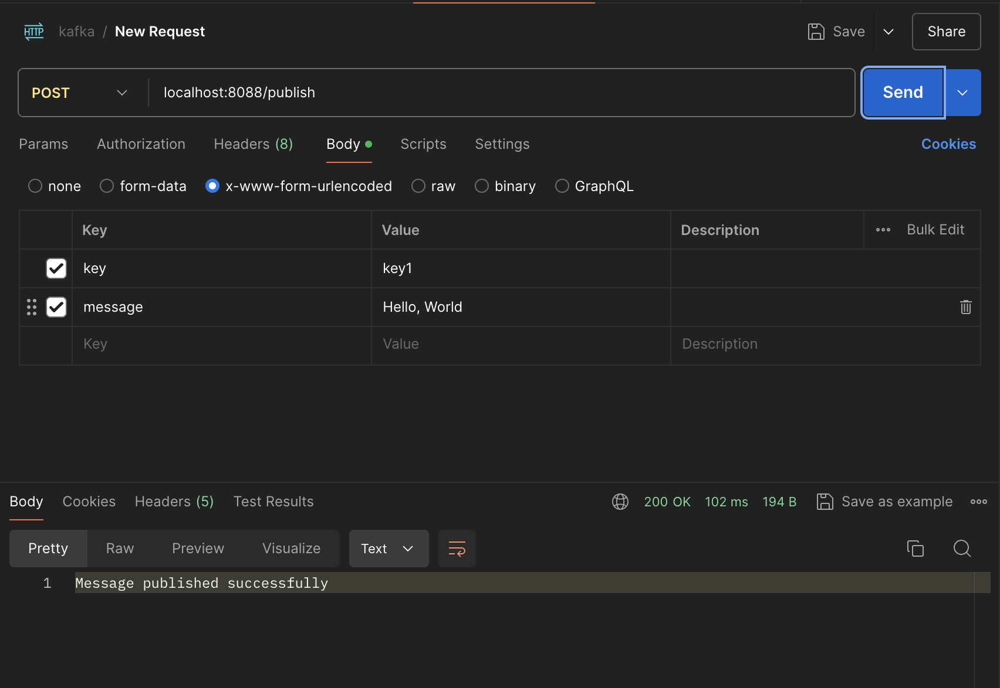
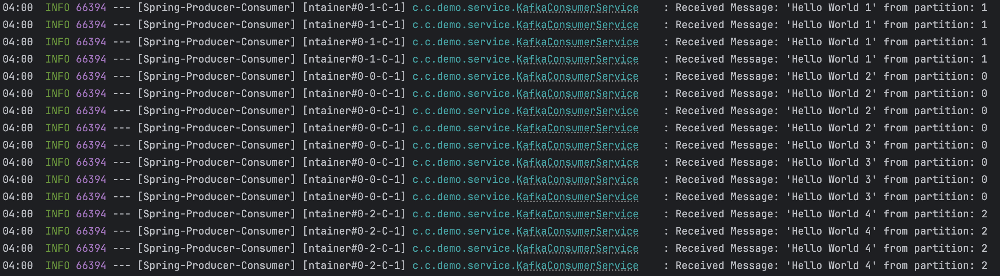
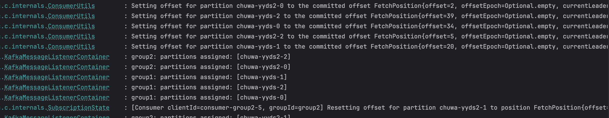
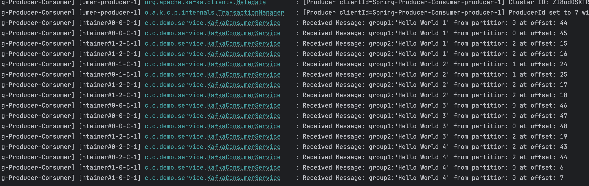
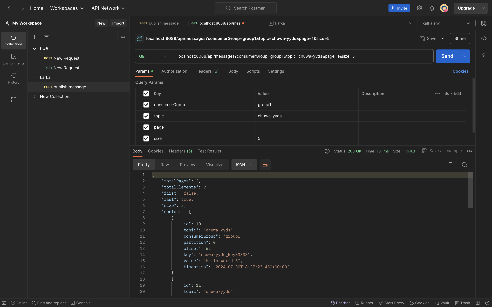

### **Step 3:** 

**Write your consumer application with Spring Kafka dependency, set up 3 consumers in a single consumer group.**

1. Prove message consumption with screenshots.

   Screenshot of postman:

   

   Screenshot of console log:

   

2. Increase number of consumers in a single consumer group, observe what happens, explain your observation.

   After increasing the number of consumers to 5, the messages are stilled consumed by only 3 consumers. That's because "chuwa-yyds" only has 3 partitions so 2 consumers won't be assigned to any partition. In this case we should increase the number of partitions to match the number of consumers.


### Step 4: 

**Create multiple consumer groups using Spring Kafka, set up different numbers of consumers within each group, observe consumer offset,**

1. Prove that each consumer group is consuming messages on topics as expected, take screenshots of offset records,

   

   

### Step5:

**Design backend REST APIs for your consumer application which satisfies following requirements:**

- As a user, I am able to get messages consumed by the consumer application
- As a user, I am able to specify which consumer group and topic that I want to get messages from
- The REST response should be optimized (e.g. paged)


I used a mysql database to store the consumed messages:

```java
package com.chuwa.demo.entity;


import jakarta.persistence.*;

import java.sql.Timestamp;

@Entity
public class ConsumedMessage {

    @Id
    @GeneratedValue(strategy = GenerationType.IDENTITY)
    private Long id;
    private String topic;
    private String consumerGroup;

    @Column(name = "`partition`")
    private int partition;

    private long offset;

    @Column(name = "`key`")  // 使用反引号转义
    private String key;

    private String value;
    private Timestamp timestamp;

    public ConsumedMessage() {
    }

    public ConsumedMessage(String topic, String consumerGroup, int partition, long offset, String key, String value) {
        this.topic = topic;
        this.consumerGroup = consumerGroup;
        this.partition = partition;
        this.offset = offset;
        this.key = key;
        this.value = value;
        this.timestamp = new Timestamp(System.currentTimeMillis());
    }

    // Getters and setters

    public Long getId() {
        return id;
    }

    public void setId(Long id) {
        this.id = id;
    }

    public String getTopic() {
        return topic;
    }

    public void setTopic(String topic) {
        this.topic = topic;
    }

    public String getConsumerGroup() {
        return consumerGroup;
    }

    public void setConsumerGroup(String consumerGroup) {
        this.consumerGroup = consumerGroup;
    }

    public int getPartition() {
        return partition;
    }

    public void setPartition(int partition) {
        this.partition = partition;
    }

    public long getOffset() {
        return offset;
    }

    public void setOffset(long offset) {
        this.offset = offset;
    }

    public String getKey() {
        return key;
    }

    public void setKey(String key) {
        this.key = key;
    }

    public String getValue() {
        return value;
    }

    public void setValue(String value) {
        this.value = value;
    }

    public Timestamp getTimestamp() {
        return timestamp;
    }

    public void setTimestamp(Timestamp timestamp) {
        this.timestamp = timestamp;
    }
}
```

Save messages in the consumer:

```java
package com.chuwa.demo.service;

import com.chuwa.demo.entity.ConsumedMessage;
import com.chuwa.demo.repository.MessageRepository;
import org.apache.kafka.clients.consumer.ConsumerRecord;
import org.springframework.beans.factory.annotation.Autowired;
import org.springframework.beans.factory.annotation.Value;
import org.springframework.kafka.annotation.KafkaListener;
import org.springframework.stereotype.Service;
import org.slf4j.Logger;
import org.slf4j.LoggerFactory;

@Service
public class KafkaConsumerService {

    private static final Logger logger = LoggerFactory.getLogger(KafkaConsumerService.class);

    @Value("${kafka.topic.name}")
    private String topicName;

    @Value("${kafka.consumer.group-id}")
    private String groupId;

    @Value("${kafka.consumer.group-id2}")
    private String groupId2;

    @Autowired
    MessageRepository messageRepository;

    @KafkaListener(topics = "${kafka.topic.name}", groupId = "${kafka.consumer.group-id}")
    public void listenGroupFoo(ConsumerRecord<String, String> record) {
        logger.info("Received Message: {}:'{}' from partition: {} at offset: {}", groupId, record.value(), record.partition(), record.offset());
        ConsumedMessage consumedMessage = new ConsumedMessage(record.topic(), groupId, record.partition(), record.offset(), record.key(), record.value());
        messageRepository.save(consumedMessage);
//        logger.info("Consumed message: {}, which is written in to database", consumedMessage);
    }

    @KafkaListener(topics = "${kafka.topic.name2}", groupId = "${kafka.consumer.group-id2}")
    public void listenGroupFoo2(ConsumerRecord<String, String> record) {
        logger.info("Received Message: {}:'{}' from partition: {} at offset: {}", groupId2, record.value(), record.partition(), record.offset());
        ConsumedMessage consumedMessage = new ConsumedMessage(record.topic(), groupId2, record.partition(), record.offset(), record.key(), record.value());
        messageRepository.save(consumedMessage);
    }
}

```

And I used a MessageController to handle the requests from user wanting to get consumed messages. Here is the postman test screenshot.



