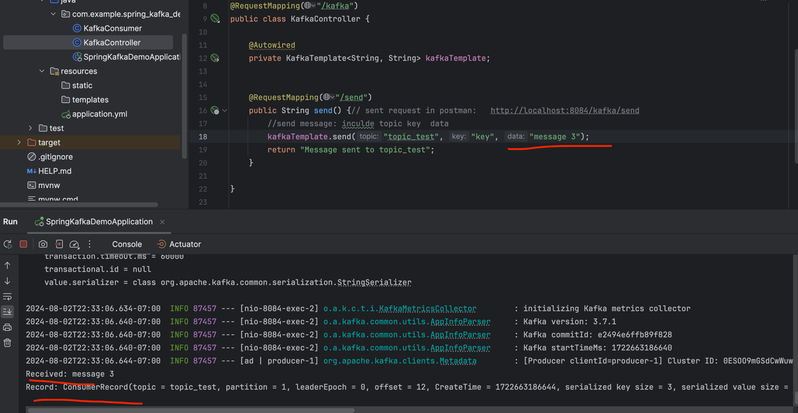
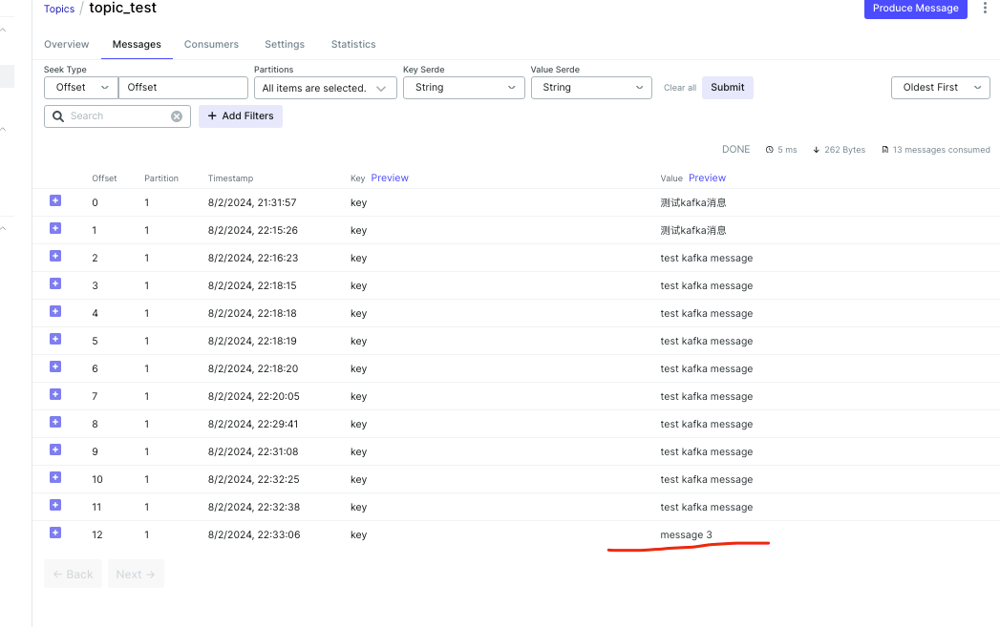
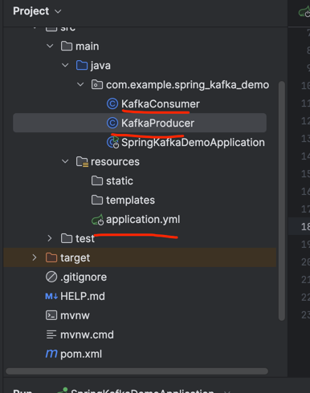

## kafka HW requirements
note: will be the first part of my final project
please submit below 5 steps as ONE SINGLE branch to github.


### Step 1: Use following docker-compose file to start 3 brokers on your computer, this docker-compose also includes a kafka visualization tool, 
once your containers started, you may visit http://localhost:8080/ to get everything about your brokers and topics
```yaml
 services:
   zookeeper:
     image: confluentinc/cp-zookeeper:latest
     container_name: zookeeper
     restart: unless-stopped
     ports:
       - '32181:32181'
       - '2888:2888'
       - '3888:3888'
     environment:
       ZOOKEEPER_SERVER_ID: 1
       ZOOKEEPER_CLIENT_PORT: 32181
       ZOOKEEPER_TICK_TIME: 2000
       ZOOKEEPER_INIT_LIMIT: 5
       ZOOKEEPER_SYNC_LIMIT: 2
       ZOOKEEPER_SERVERS: zookeeper:2888:3888
     healthcheck:
       test: echo stat | nc localhost 32181
       interval: 10s
       timeout: 10s
       retries: 3
     networks:
       - kafka
     logging:
       driver: "json-file"
       options:
         max-size: "1m"

   kafka-ui:
     container_name: kafka-ui
     image: provectuslabs/kafka-ui:latest
     ports:
       - 8080:8080
     depends_on:
       - broker-1
       - broker-2
       - broker-3
     environment:
       KAFKA_CLUSTERS_0_NAME: broker-1
       KAFKA_CLUSTERS_0_BOOTSTRAPSERVERS: broker-1:29091
       KAFKA_CLUSTERS_0_METRICS_PORT: 19101
       KAFKA_CLUSTERS_1_NAME: broker-2
       KAFKA_CLUSTERS_1_BOOTSTRAPSERVERS: broker-2:29092
       KAFKA_CLUSTERS_1_METRICS_PORT: 19102
       KAFKA_CLUSTERS_2_NAME: broker-3
       KAFKA_CLUSTERS_2_BOOTSTRAPSERVERS: broker-3:29093
       KAFKA_CLUSTERS_2_METRICS_PORT: 19103
       DYNAMIC_CONFIG_ENABLED: 'true'
     networks:
       - kafka
     logging:
       driver: "json-file"
       options:
         max-size: "1m"

   broker-1:
     image: confluentinc/cp-kafka:latest
     container_name: broker-1
     restart: unless-stopped
     ports:
       - '9091:9091'
     depends_on:
       - zookeeper
     environment:
       KAFKA_BROKER_ID: 1
       KAFKA_ZOOKEEPER_CONNECT: zookeeper:32181
       KAFKA_LISTENER_SECURITY_PROTOCOL_MAP: INTERNAL:PLAINTEXT,EXTERNAL:PLAINTEXT
       KAFKA_INTER_BROKER_LISTENER_NAME: INTERNAL
       KAFKA_ADVERTISED_LISTENERS: INTERNAL://broker-1:29091,EXTERNAL://localhost:9091
       KAFKA_DEFAULT_REPLICATION_FACTOR: 3
       KAFKA_NUM_PARTITIONS: 3
       KAFKA_JMX_PORT: 19101
       KAFKA_JMX_HOSTNAME: localhost
     healthcheck:
       test: nc -vz localhost 9091
       interval: 10s
       timeout: 10s
       retries: 3
     networks:
       - kafka
     logging:
       driver: "json-file"
       options:
         max-size: "1m"

   broker-2:

     image: confluentinc/cp-kafka:latest
     container_name: broker-2
     restart: unless-stopped
     ports:
       - '9092:9092'
     depends_on:
       - zookeeper
     environment:
       KAFKA_BROKER_ID: 2
       KAFKA_ZOOKEEPER_CONNECT: zookeeper:32181
       KAFKA_LISTENER_SECURITY_PROTOCOL_MAP: INTERNAL:PLAINTEXT,EXTERNAL:PLAINTEXT
       KAFKA_INTER_BROKER_LISTENER_NAME: INTERNAL
       KAFKA_ADVERTISED_LISTENERS: INTERNAL://broker-2:29092,EXTERNAL://localhost:9092
       KAFKA_DEFAULT_REPLICATION_FACTOR: 3
       KAFKA_NUM_PARTITIONS: 3
       KAFKA_JMX_PORT: 19102
       KAFKA_JMX_HOSTNAME: localhost
     healthcheck:
       test: nc -vz localhost 9092
       interval: 10s
       timeout: 10s
       retries: 3
     networks:
       - kafka
     logging:
       driver: "json-file"
       options:
         max-size: "1m"

   broker-3:
     image: confluentinc/cp-kafka:latest
     container_name: broker-3
     restart: unless-stopped
     ports:
       - '9093:9093'
     depends_on:
       - zookeeper
     environment:
       KAFKA_BROKER_ID: 3
       KAFKA_ZOOKEEPER_CONNECT: zookeeper:32181
       KAFKA_LISTENER_SECURITY_PROTOCOL_MAP: INTERNAL:PLAINTEXT,EXTERNAL:PLAINTEXT
       KAFKA_INTER_BROKER_LISTENER_NAME: INTERNAL
       KAFKA_ADVERTISED_LISTENERS: INTERNAL://broker-3:29093,EXTERNAL://localhost:9093
       KAFKA_DEFAULT_REPLICATION_FACTOR: 3
       KAFKA_NUM_PARTITIONS: 3
       KAFKA_JMX_PORT: 19103
       KAFKA_JMX_HOSTNAME: localhost
     healthcheck:
       test: nc -vz localhost 9093
       interval: 10s
       timeout: 10s
       retries: 3
     networks:
       - kafka
     logging:
       driver: "json-file"
       options:
         max-size: "1m"


 networks:
   kafka:
     name: kafka
```

### Step 2: Run https://github.com/CTYue/Spring-Producer-Consumer/ on your local, only producer is included in this repo as of now. (edited) 

Prove message consumption with screenshots.
Increase number of consumers in a single consumer group, observe what happens, explain your observation.

note: Write your consumer application with Spring Kafka dependency, set up 3 consumers in a single consumer group.…
Please figure out a good approach to generate partition keys, so your message can be redirected to different partitions. (My demo producer curl has a fixed partition key) (

Create  a topic with number of partitions and replicas (on docker brokers):
docker exec -it <your-broker-container-id> kafka-topics.sh --create --topic <your-topic-name> --bootstrap-server <your-broker-container-id>:9092 --partitions 3 --replication-factor 2
the topic chuwa-yyds was created with 3 partitions by default in the sample producer, you may create your own with different number of partition to observe the difference. (edited)

### Step 4: Create multiple consumer groups using Spring Kafka, set up different numbers of consumers within each group, observe consumer offset,
Prove that each consumer group is consuming messages on topics as expected, take screenshots of offset records,
Demo different message delivery guarantees in Kafka, with necessary code or configuration changes.

### Step 5: Design backend REST APIs for your consumer application which satisfies following requirements:
As a user, I am able to get messages consumed by the consumer application
As a  user, I am able to specify which consumer group and topic that I want to get messages from
The REST response should be optimized (e.g. paged)









