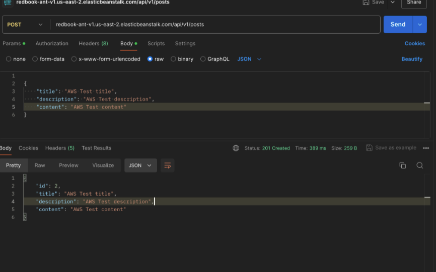
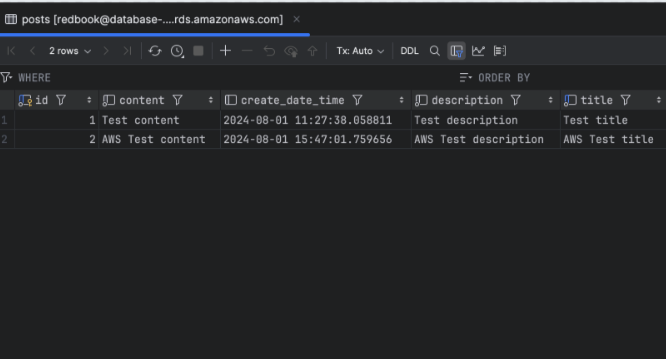

requirements of AWS HW
finish deploy of your AWS API and share your API for other to test (one at least test another student’s API by sending a POST request)
submit your HW with screen-shot and testing request/response.

