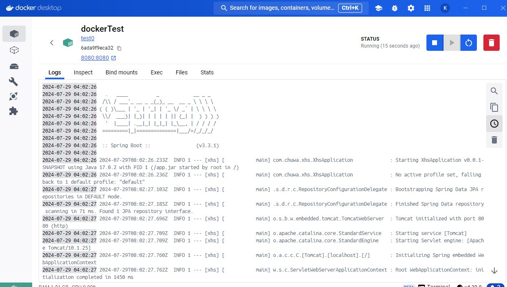
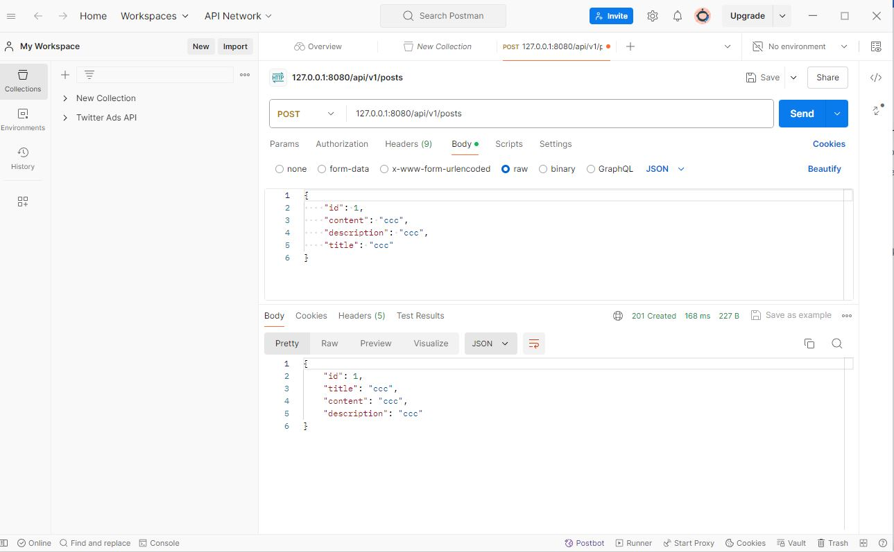

## 1.  Explain following concepts:
### 1.  Docker daemon
* The server-side component of the Docker Engine that runs as a background process on the host system. It is responsible for creating, managing, and orchestrating containers.

### 2.  Docker host 
* Host is the machine managing the containers and images

### 3.  Docker Registry
* A registry is a location where we can store and distribute Docker images. Public registries, such as Docker Hub, 
are available for sharing images, while Docker Registry can be used to create private registries. 

### 4.  Image/Image Tag
* A Docker image is a snapshot or blueprint of the libraries and dependencies required inside a container for an application to run.
* After the image name, the optional TAG is a custom, human-readable manifest identifier that's typically a specific version or variant of an image

### 5.  Container Volume
* Docker volume is a mechanism for persisting and managing data generated by user or by Docker containers. It 
allows you to separate the data from the container's lifecycle, enabling you to persist data even after the 
container has been stopped or removed. Docker volumes are useful for sharing data between containers and 
for storing data that must be retained across container restarts.

### 6.  Docker Namespace
* container only knows what it can see if it is in a certain namespace

## 2.  Dockerize you lastest home work project.

## 5.  Try mapping host file path to contain's file path, or vice versa.
* use -v (--volume) or --mount

## 6.  Test and verify if your app's functionalities remain same after Dockerization.
