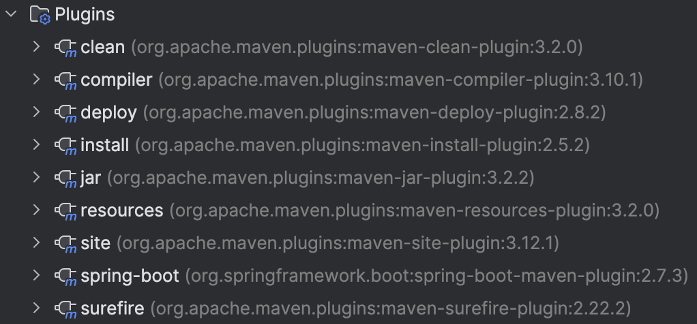

2. practice git using the platform. list the git commands you learned

   ```shell
   git init
   git clone <url>
   git checkout [branch | tag | commit_history]
   git merge [branch]
   git rebase <branch>
   git rebase -i <HEAD>
   git branch -f main HEAD~3
   git reset [--soft | --mixed | --hard] [HEAD] [file1] [file2] 
   git revert HEAD 
   git cherry-pick [commit1] [commit2] ...
   ```

   

3. What is the basic steps to init a git repo in you local?

   ```shell
   cd my-repo
   git init
   git add .
   git commit -m "initial repository"
   ```

4. How to clone a repo from Github ?

   ```shell
   git clone https://github.com/user_name/repo_name.git
   ```

5. How to create a new branch and checkout to that branch

   ```shell
   git branch <new_branch>
   git checkout <new_branch>
   
   # or use `-b` option with `git checkout`
   git checkout -b <new_branch>
   ```

6. How to merge the branch_test to master branch in command ? show me the commands

   ```shell
   git checkout master
   git merge branch_test # end here if no conflicts 
   
   # if there are conflicts, solve them manually then:
   git add <resolved-file>
   git commit
   ```

7. How to **stash** your new code before leaving branch **branch_learn_stash** and pop your stash when you checkout back to **branch_learn_stash** ? try commands way and intellij way.

   - Commands:

     ```shell
     git stash
     git checkout main
     git checkout branch_learn_stash
     git stash pop
     ```

   - IntelliJ:

     **stash**: Go to `VCS` > `Git` > `Stash Changes...` > add a message for the stash > `Stash`

     **stash pop**: Go to `VCS` > `Git` > `Unstash Changes...` > select the stash you created earlier > click `Pop`

8. How do you understand PR is based on Branch?

   A PR is a request to merge changes from one branch (source branch) into another branch (target branch). PR enhances code quality, collaboration, testing, documentation, and overall project management. 

9. what are maven roles? what can it do ?

   - **Manage Dependencies**: Maven simplifies the management of project dependencies by using a central repository and a local repository to download and store libraries required by your project.
   - **Build Project Cycle**: Maven provides a standard build lifecycle that covers all the stages of a typical project build process.
   - **Documentation**: Maven can generate project documentation based on the information in the `pom.xml` file and other configuration files.
   - **Reporting**: Maven supports reporting plugins that can generate various project reports, such as code coverage, test reports, and code quality metrics.
   - **Others**: Maven can use plugins to execute tasks within the build lifecycle.  And Maven can enforce a standard project structure. ...

10. What is the lifecycle of maven? could you tell me the details ?

    1. **Clean life cycle**
       - **clean**：Removes the `target` directory generated by the build process, deletes temporary files and prepares for a fresh build.
    2. **Default(Build) life cycle**
       1. **process-resources**: This phase handles the preparation of resource files for the main source code. Resources are non-code files (e.g., properties files, configuration files) that are needed during runtime. This goal copies these files to the target directory, optionally performing filtering (e.g., replacing placeholders with actual values).
       2. **compile**: This phase compiles the main source code into bytecode that can be executed on the Java Virtual Machine (JVM). It processes the `.java` files located in the `src/main/java` directory and outputs `.class` files into the `target/classes` directory.

       3. **process-test-resources**: This phase is similar to `process-resources`, but it deals with test resources. These are non-code files required for testing purposes. The goal copies these files from `src/test/resources` to the target test directory, optionally performing filtering.

       4. **test-compile**: This phase compiles the test source code. It processes the `.java` files located in the `src/test/java` directory and outputs `.class` files into the `target/test-classes` directory. This ensures that the test classes are ready to be executed in the `test` phase.

       5. **test**: This phase runs the compiled test code using a specified testing framework, typically JUnit or TestNG. The results of these tests (pass, fail, errors) are reported, and detailed test reports are generated. This is essential for verifying that the code works as expected.

       6. **package**: During this phase, the compiled classes and resources are packaged into a JAR (Java Archive) file. This JAR file is a compressed file format that includes all necessary files to run the application. The resulting artifact is typically found in the `target` directory.

       7. **install**: This phase installs the packaged JAR file into the local Maven repository (usually located at `~/.m2/repository`). This makes the artifact available for use as a dependency in other projects on the same machine. It is an essential step for reusing the built artifact locally.
    3. **Site life cycle**
       1. **site**: generates project documentation for your Maven project. This documentation is typically created from the project's POM file and other sources like Javadoc, reports from testing frameworks, and other plugins.
       2. **deploy-site**: is used to generate the site documentation and then deploy it to a remote server. This is typically used for sharing the generated project documentation with others, for example, by publishing it on a web server or a documentation hosting service.

11. what is the difference between package and install in maven lifecycle ?

    1. **package:** the compiled classes and resources are packaged into a JAR (Java Archive) file.
    2. **install** : installs the packaged JAR file from the **package** phase into the local Maven repository. This makes the artifact available for use as a dependency in other projects on the same machine.

12. What are plugins in maven, list some plugins.

    Maven plugins are tools used to perform specific tasks during the build process. These tasks include compiling code, running tests, packaging into JAR files, deploying applications, and more.

    Example:

    

13. 
    In Repo/MavenProject directory, create a maven Module using Intellij, named it as belows:

    1. groupID: com.chuwa.learn 
    2. artifactID: java-core

​	Module is created in the Repo/MavenProject directory. In the pom file shows:

       ```xml
       <groupId>com.chuwa.learn</groupId>
       <artifactId>java-core</artifactId>
       <version>1.0-SNAPSHOT</version>
       ```