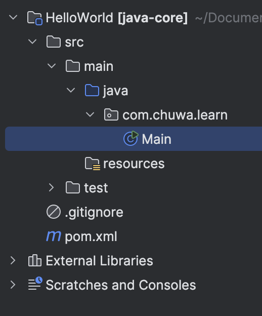

# [Answers](#Answer)
2. practice git using the platform. list the git commands you learned
    ```
   - git checkout -b new_branch
     - => git branch new_branch, git checkout new_branch
   - git merge
   - git rebase branch
   - git checkout HEAD^
   - git checkout HEAD~4
   - git branch -f main HEAD~3
   - git reset HEAD~1 
     - reset to previous commit
   - git revert HEAD 
     - will have a new commit and reset the code
   - git cherry-pick commit1 commit2
     - add the picked commit to current branch as commits
   - git rebase -i HEAD~4
    ```
3.  What is the basic steps to init a git repo in you local ?
    ```
    git init
    git add .
    git commit -m “init project”
    git push
    ```
4.  How to clone a repo from Github ?
    ```
    git clone repo_link
    ```
5.  How to create a new branch and checkout to that branch ?
    ```
    git checkout -b new_branch
    ```
6.  How to merge the branch_test to master branch in command ? show me the commands
    ```
    git merge branch_test
    ```
7.  How to stash your new code before leaving branch branch_learn_stash and pop your stash when you
    checkout back to **branch_learn_stash ? try commands way and intellij way.
    ```
    git stash
    git checkout new_branch
    git stash pop
    ```
   8.  How do you understand PR is based on Branch?
    
   Create your own branch,  and make some commits, 
   The way to merge to master branch is to create PR, others could make reviews and comments.  
    
9.  What is maven role ? what it be used to do ?
    - Maven is a build tool for mainly used for Java Projects, making the build process simple and standardized.
      - manage dependencies
      - build project   
      - to add or remove the dependencies easily
10.  What is the lifecycle of maven? could you tell me the details ?
- validate
  - Validates that the project is correct and all necessary information is available.   
- compile
  - Compiles the project's source code.
- test
  - Run tests using a suitable testing framework
- package
  - Packages the compiled code into its distributable format, sucha as a JAR or WAR file.
- verify
  - Runs checks to verify the packages is valid and meets quality standards.
- install
  - installs the package into the local repository for use as a dependency in other projects locally.
- deploy
  - Copies the final package to the remote repository for sharing with other developers and projects.

11.  what is the difference between package and install in maven lifecycle ?   
    Package is to package the compiled code to packages, while install is to install dependencies from central or remote repository.

12.  What is plugins in maven, list some plugins.
     Plugins are ways to extend and customize the build process.   
- maven-jar-plugin
  - packages the compiled code into a JAR file.   
- maven-deploy-plugin
  - deploy the built artifact to a remote repository.
    
       
13.  In Repo/MavenProject directory, create a maven Module using Intellij, named it as belows:
    
14. Do Code Review: Go over the PRs in your repo, tried to leave some useful or useful comments in other
        students' PR, please don't merge it.
        commented [PR#3](https://github.com/Liam-Zhou/chuwa0610/pull/3)
