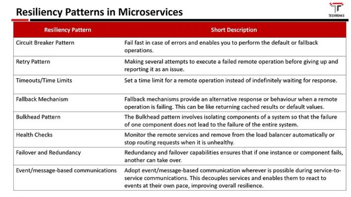

## 2.  Document the microservice architeture and components/tools/dependencies
* splits one large application into multiple small and independent service based applications.
* API Gateway
* Service Discovery(Eureka)
* Load Balancer
* Circuit Breaker
* Config Server
* Kafka
* Docker

## 3.  What are Resilience patterns? What is circuit breaker?
* Resilience patterns: Resilience patterns are design patterns that help to build applications that can withstand and recover from failures.

## 4.  Read this article, then list the important questions, then write your answers 
### What are the benefits and drawbacks of Microservices?
* Benefits: independent, scalability, Simplicity in debugging & maintenance. 
* Drawbacks:  testing and monitoring are more difficult, Complex development. 

### Name three common tools mostly used for microservices.
* Wiremock, Docker, Hystrix

### Explain how independent microservices communicate with each other.
* HTTP/REST with JSON or binary protocol for request-response 
* Websockets for streaming.  
* A broker or server program that uses advanced routing algorithms. (RabbitMQ, Nats, Kafka, etc)

### Explain the term Eureka
* Eureka is an application that keeps track of all client-service applications. As every Microservice registers to Eureka Server, Eureka Server knows all the client applications running on the different ports and IP addresses.

### Explain OAuth
*  OAuth enables users to authenticate themselves with third-party service providers

### Explain the role of an API Gateway.
An API Gateway acts as a reverse proxy to accept all API calls, aggregate the various services required to fulfill them, and return the appropriate result.

## 5.  how to do load balance in microservice? Write a long Summary by yourself.
* load balaoce is distributing incoming network traffic across multiple servers.
* Where: between client, server, application servers, cache servers, database servers.
* How: Software, Hardware
* Algorithms: 
* Static: Round Robin, Weighted Round-Robin, Source IP hash...
* Dynamic: Least Connection, Least Response Time, server status...

## 6.  How to do service discovery?
### Client-Side: 
* The client is responsible for determining the network location of available service instances and request load balancing
* Service Registration, Service Lookup, Load Balancing
* Example: Eureka

### Server-Side:
* Clients make requests to the service through the load balancer. The LB queries the service registry and routes.
* Example: AWS ELB, reverse proxy
