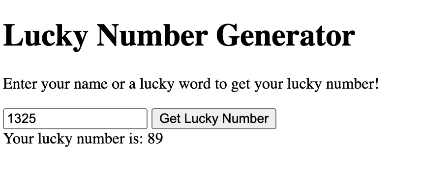

1.  Read and practice all sample codes from 71-Dom-Bom-JavaScript-Typescript-Node.md on your local browser or an online compiler.
2.  Compare  let vs  var with your own code examples.

    | var                 | let                   |
        |---------------------|-----------------------|
    | function-scoped     | block-scoped          |
    | var allows redefine | not allow to redefine |
    ```
    var test = 1;
    var test = 2;
    let ltest = 1;
    // let ltest = 2; //Cannot redeclare block-scoped variable
    
    function exampleFunction() {
      if (true) {
        var functionScopedVar = "I'm function-scoped!";
        let blockScopedLet = "I'm block-scoped!";
       
      }

      console.log(functionScopedVar); // Output: "I'm function-scoped!"
      console.log(blockScopedLet); // Reference Error blockScopedLet is not defined
    
    }

    exampleFunction();
    ```
3.  Write an HTML page that generates a lucky number based on the date, time, and user inputs. Users should be able to get their random lucky numbers by clicking a button or using the enter key after typing
    the input.
    ```
    <body>

      <h1>Lucky Number Generator</h1>
      <p>Enter your name or a lucky word to get your lucky number!</p>
      <input type="text" id="userInput" placeholder="Enter here...">
      <button onclick="generateLuckyNumber()">Get Lucky Number</button>
      <div class="lucky-number" id="luckyNumber"></div>


    <script>
      function generateLuckyNumber() {
          const input = document.getElementById('userInput').value;
          const currentDate = new Date();
          const luckyNumber = calculateLuckyNumber(input, currentDate);
          document.getElementById('luckyNumber').innerText = `Your lucky number is: ${luckyNumber}`;
      }

      function calculateLuckyNumber(input, date) {
          const inputSum = input.split('').reduce((sum, char) => sum + char.charCodeAt(0), 0);
          const dateSum = date.getFullYear() + date.getMonth() + 1 + date.getDate() + date.getHours() + date.getMinutes() + date.getSeconds();
          return (inputSum + dateSum) % 100; 
      }

  
      document.getElementById('userInput').addEventListener('keypress', function(event) {
          if (event.key === 'Enter') {
              generateLuckyNumber();
          }
      });
    </script>
    </body>
    ```
    
4. Write an HTML page that returns a user's GitHub repos (https://api.github.com/users/{user_id}/repos) in
    JSON format. The web page should have a text box and a submit button where users can provide the
    GitHub user ID. The fetch call should be asynchronous. If the call to the above API fails for any reason, you
    should return a customized, user-friendly error message. If you know more than one approach to
    implement the asynchronous call, please do it using different approaches.


```
    <body>
      <p>Enter Github UserID</p>
      <input type="text" id="userInput" placeholder="Enter here...">
      <button onclick="fetchData()">Submit</button>
      <div  id="result"></div>
  

  <script>
      async function fetchData()
      {
        const UserID = document.getElementById('userInput').value;
        try {
          let Url = 'https://api.github.com/users/' + UserID+'/repos'
          let response = await fetch(Url);
          let data = await  response.json();
          console.log(data);
          // return data;
        } catch (error) {
          console.error('Error', error);
        }

        
      }
</body>
```

5.  Explain Event Loop, Macrotask, and Microtask with code samples.
    - Event Loop:  
      - responsible for managing the execution of code, handling events, and managing tasks in the execution queue. 
      - It continually checks the call stack (where functions are executed) to see if it's empty. If the stack is empty, the event loop picks the next task from the task queues (macrotasks and microtasks) to execute.
    - Macrotask:
      - Macrotasks are larger tasks that include operations such as I/O events, eg:  setTimeout, setInterval
    - Microtask:
      - Microtasks are smaller tasks that are prioritized over macrotasks and are executed immediately after the currently executing script completes.
      - PromiseJobs, MutationObserver
    ```
      <script>
        console.log('Start'); // First log
        
        // schedule macrotask
        setTimeout(() => {
        console.log('Macrotask: setTimeout'); // Fourth log
        }, 1000);
        
        // schedule microtask
        Promise.resolve().then(() => {
        console.log('Microtask: Promise 1'); // Second log
        }).then(() => {
        console.log('Microtask: Promise 2'); // Third log
        });
        
        console.log('End'); // Second log
        
    </script>
    ```
