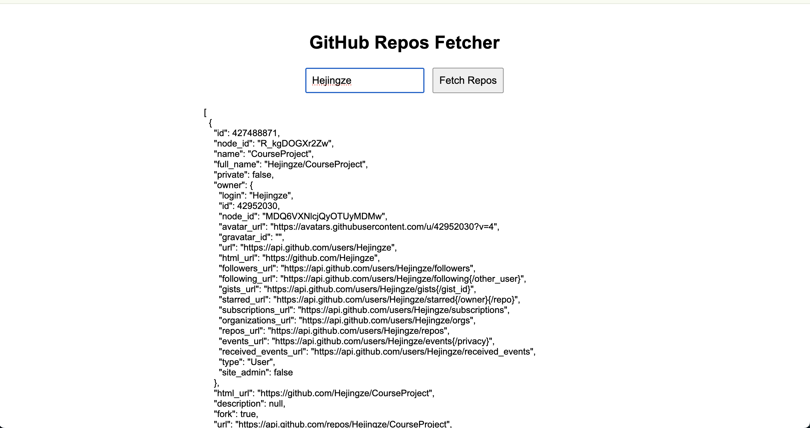

# HW20

## 1. Read and practice all sample codes from 71-Dom-Bom-JavaScript-Typescript-Node.md on your local browser or an online compiler.

## 2. Compare let vs var with your own code examples.

### 1. Scope:
- var is function-scoped
- let is block-scoped
```javascript
function testVar() {
    var x = 10;
    if (true) {
        var x = 20;  // Same variable as above
        console.log(x); // 20
    }
    console.log(x); // 20
}

function testLet() {
    let y = 10;
    if (true) {
        let y = 20;  // Different variable
        console.log(y); // 20
    }
    console.log(y); // 10
}
testVar();
testLet();
```

### 2. Hoisting
- var variables are hoisted to the top of their scope and initialized with undefined.
- let variables are hoisted but are not initialized (i.e., they remain in a "temporal dead zone" until the declaration is encountered).
```javascript
function hoistingVar() {
    console.log(a); // undefined
    var a = 10;
    console.log(a); // 10
}

function hoistingLet() {
    // console.log(b); // Uncaught ReferenceError: Cannot access 'b' before initialization
    let b = 10;
    console.log(b); // 10
}
hoistingVar();
hoistingLet();
```

### 3. Re-declaration
- var allows re-declaration within the same scope.
- let does not allow re-declaration within the same scope.
```javascript
var c = 5;
var c = 10; // No error
console.log(c); // 10

let d = 5;
// let d = 10; // Uncaught SyntaxError: Identifier 'd' has already been declared
d = 10; // Correct way to update the value
console.log(d); // 10
```

## 3. Write an HTML page that generates a lucky number based on the date, time, and user inputs. Users should be able to get their random lucky numbers by clicking a button or using the enter key after typing the input.

- Refer to the lucky.html inside of the hwjavascript folder.


## 4. Write an HTML page that returns a user's GitHub repos (https://api.github.com/users/{user_id}/repos) in JSON format. The web page should have a text box and a submit button where users can provide the GitHub user ID. The fetch call should be asynchronous. If the call to the above API fails for any reason, you should return a customized, user-friendly error message. If you know more than one approach to implement the asynchronous call, please do it using different approaches.

- Refer to the github.html inside of the hwjavascript folder.


## 5. Explain Event Loop, Macrotask, and Microtask with code samples.

- Event Loop: Manages execution of synchronous (Call Stack) and asynchronous tasks (Queues).

- Macrotask: Includes setTimeout, setInterval, I/O operations and Executes after the Call Stack is empty.

- Microtask: Includes Promises and MutationObserver and Executes before Macrotasks, immediately after the Call Stack is clear.

- Ex:
```javascript
console.log('Start'); // 1

setTimeout(() => {
    console.log('Macrotask: setTimeout'); // 6
}, 0);

Promise.resolve()
    .then(() => console.log('Microtask: Promise 1')) // 3
    .then(() => console.log('Microtask: Promise 2')); // 4

console.log('End'); // 2

setTimeout(() => {
    console.log('Macrotask: setTimeout 2'); // 7
}, 0);
```
