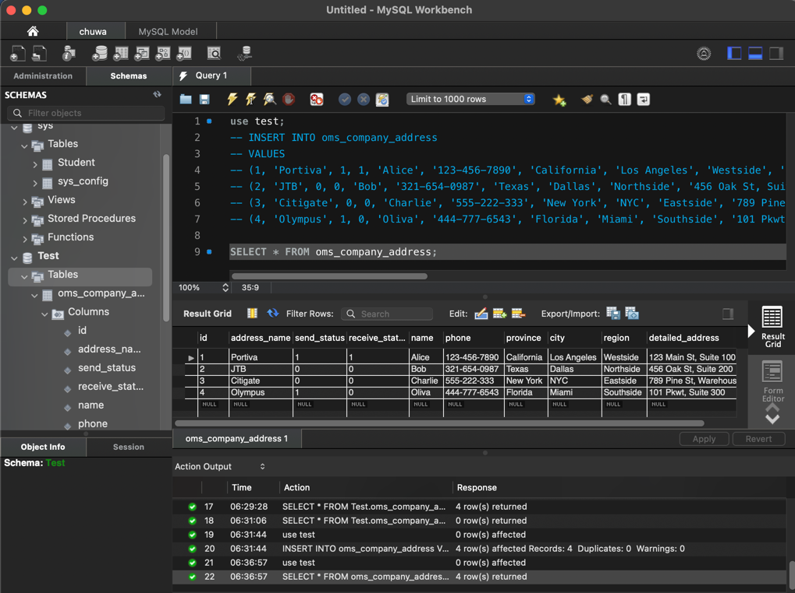
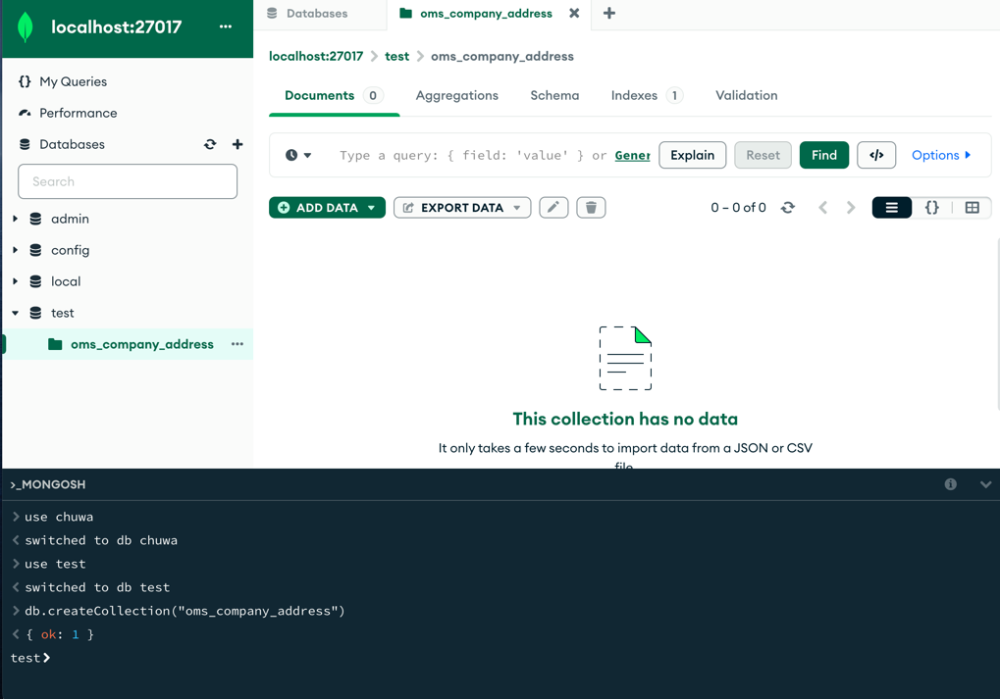
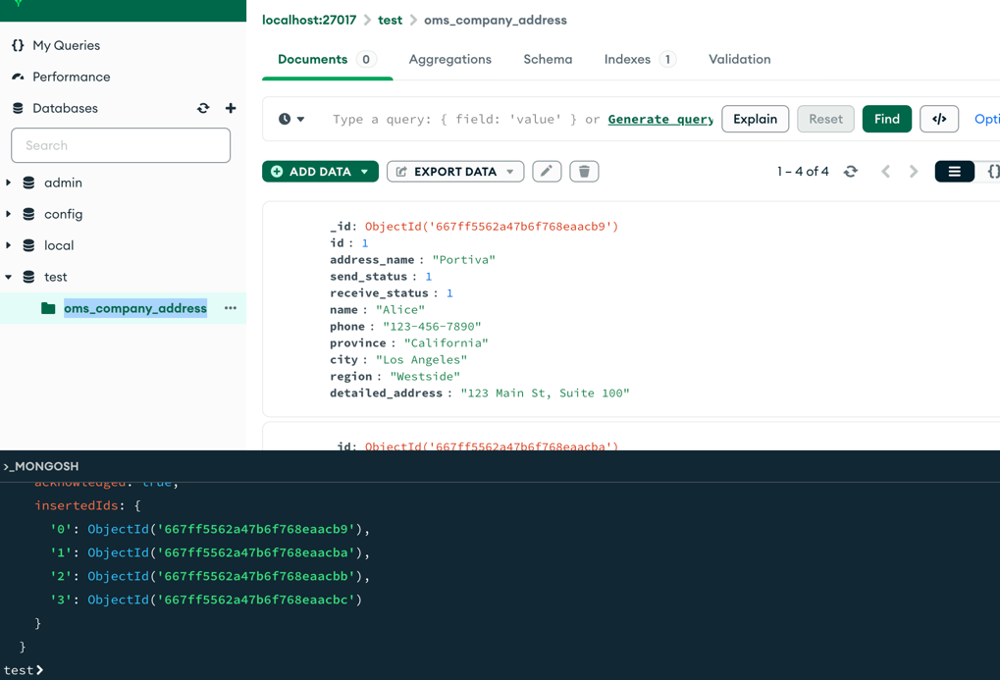

# MySQL
## 1. Create oms_company_address table

```sql
CREATE TABLE oms_company_address (
    id bigint PRIMARY KEY,
    address_name varchar(200),
    send_status int(1),
    receive_status int(1),
    name varchar(64),
    phone varchar(64),
    province varchar(64),
    city varchar(64),
    region varchar(64),
    detailed_address varchar(200)
);
```
## 2. Insert some random data to oms_company_address table
```sql
INSERT INTO oms_company_address
VALUES 
(1, 'Portiva', 1, 1, 'Alice', '123-456-7890', 'California', 'Los Angeles', 'Westside', '123 Main St, Suite 100'),
(2, 'JTB', 0, 0, 'Bob', '321-654-0987', 'Texas', 'Dallas', 'Northside', '456 Oak St, Suite 200'),
(3, 'Citigate', 0, 0, 'Charlie', '555-222-333', 'New York', 'NYC', 'Eastside', '789 Pine St, Warehouse 3'),
(4, 'Olympus', 1, 0, 'Oliva', '444-777-6543', 'Florida', 'Miami', 'Southside', '101 Pkwt, Suite 300');```
```

## 3. Write a SQL query to fetch all data from oms_company_address `table
```sql
SELECT * FROM oms_company_address;
```

## 4. Write a SQL query to fetch top 3 records from oms_company_address table
```sql
SELECT * FROM oms_company_address LIMIT 3;
```

## 5. Update oms_company_address table to set all phone to 666-6666-8888
```sql
UPDATE oms_company_address
SET phone = '666-6666-8888'
WHERE id IS NOT NULL;
```

## 6. Delete one entry from oms_company_address table
```sql
DELETE FROM oms_company_address 
WHERE address_name = 'Citigate';
```

# NoSQL

## 1 & 2. Create oms_company_address table
```mongodb-json
use test
db.createCollection("oms_company_address")
```
## 3. Insert few random entries to oms_company_address collection (method: insert() )
```mongodb-json
db.oms_company_address.insert([
{ id: 1, address_name: "Portiva", send_status: 1, receive_status: 1, name: "Alice", phone: "123-456-7890", province: "California", city: "Los Angeles", region: "Westside", detailed_address: "123 Main St, Suite 100" },
{ id: 2, address_name: "JTB", send_status: 0, receive_status: 0, name: "Bob", phone: "321-654-0987", province: "Texas", city: "Dallas", region: "Northside", detailed_address: "456 Oak St, Suite 200" },
{ id: 3, address_name: "Citigate", send_status: 0, receive_status: 0, name: "Charlie", phone: "555-222-333", province: "New York", city: "NYC", region: "Eastside", detailed_address: "789 Pine St, Warehouse 3" },
{ id: 4, address_name: "Olympus", send_status: 1, receive_status: 0, name: "Oliva", phone: "444-777-6543", province: "Florida", city: "Miami", region: "Southside", detailed_address: "101 Pkwt, Suite 300" }
])
```


## 4. Read one entry from oms_company_address collection (method: find() )
```mongodb-json
db.oms_company_address.find({"id":3})
```

## 5. Read all entries from oms_company_address collection (method: find() )
```mongodb-json
db.oms_company_address.find()
```

## 6. Update one entry from oms_company_address collection (method: update() or save() )
```mongodb-json
db.oms_company_address.update(
    { address_name: "Citigate" }, 
    { $set: {  phone: "666-6666-8888", } }
)
// update all
db.oms_company_address.update(
    {}, 
    { $set: {  phone: "666-6666-8888", } }
)

```

## 7. Remove one entry from oms_company_address collection (method: remove() )
```mongodb-json
db.oms_company_address.remove({"id":3})
```

# API Design
## 1. find the customer's payments, like credit card 1, credit card 2, paypal, Apple Pay.
```GET /api/v1/customer/{customer_id}/payments```

## 2. Find the customer's history orders from 10/10/2022 to 10/24/2022
```GET /api/v1/customer/{customer_id}/orders?start-date=10-10-2022&end-date=10-24-2022```

## 3. find the customer's delivery addresses
```GET /api/v1/customer/{customer_id}/delivery-addresses```

## 4. If I also want to get customer's default payment and default delivery address, what kind of the API (URL) should be?

```
GET /api/v1/customer/{customer_id}/payment?type=default
GET /api/v1/customer/{customer_id}/delivery-addresses?type=default
```

## 5. Find 2 collection of APIs example. ie. Twitter, Paypal, Youtube etc. --

#### PayPal Subscriptions API 
- `POST /v1/billing/plans`: Create a new subscription plan.  
- `GET /v1/billing/plans/{plan_id}`: Retrieve details of a 
  specific subscription plan. 
- `POST /v1/billing/subscriptions`: Create a new subscription. 
- `GET /v1/billing/subscriptions/{subscription_id}`: Retrieve details of a specific subscription. 
- `POST /v1/billing/subscriptions/{subscription_id}/cancel`: Cancel a subscription.


#### Twitter Streaming API

- `GET /statuses/filter`: Returns public statuses that match one or more filter predicates.
- `GET /statuses/sample`: Returns a small random sample of all public statuses.
- `GET /user`: Streams a real-time feed of the authenticated user’s data.

### 6. Design a collection of APIs for a Blog Website, please specify GET POST PUT DELETE
- GET
  - `GET api/v1/user/{id}/posts`: get all posts of a specific user
- POST
  - `POST /api/v1/user/{id}/posts`: create a post of a user 
- PUT
  - `PUT /api/v1/user/{id}/posts?post-id={pid}`: update the post content of a user
- DELETE
  - `DELETE /api/v1/user/{id}/posts?post-id={pid}`: delete a post of a user
