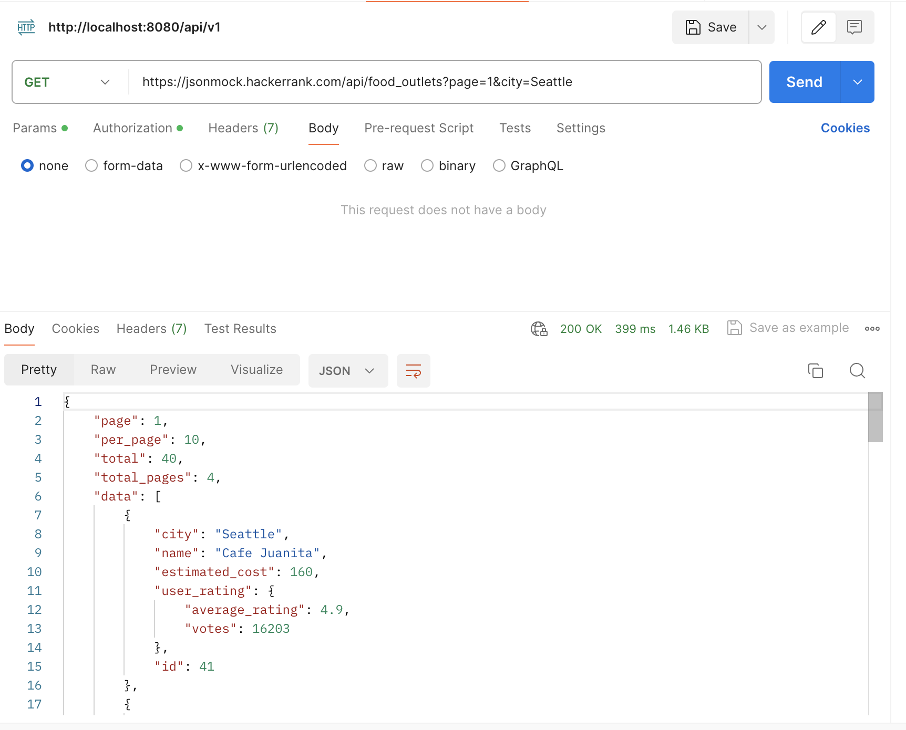

# [HW30_RESTFul_API](#HW30_RESTFul_API)
Practice with below examples (You can find any Open APIs on the internet):   
1. 5 GET APIs with different response type
   1. GET https://jsonmock.hackerrank.com/api/food_outlets   
   
   2. GET https://jsonmock.hackerrank.com/api/food_outlets?page=1   
   
   3. GET https://jsonmock.hackerrank.com/api/food_outlets?page=1&city=Seattle
   
   4. GET https://jsonmock.hackerrank.com/api/food_outlets?page=1&id=41
   
   5. GET https://jsonmock.hackerrank.com/api/food_outlets?page=4
   
    
2. 5 Post API with json request body, please also paste the response here
   1. POST https://jsonplaceholder.typicode.com/posts
   
   2. POST https://jsonplaceholder.typicode.com/posts
   
   3. POST https://jsonplaceholder.typicode.com/posts
   
   4. POST https://jsonplaceholder.typicode.com/posts
   
   5. POST https://jsonplaceholder.typicode.com/posts
   
3. 3 PUT API with json request body, please also paste the response here 
   1. PUT https://sonplaceholder.typicode.com/posts/100
   
   2. PUT https://sonplaceholder.typicode.com/posts/100
   
   3. PUT https://sonplaceholder.typicode.com/posts/100
   
   
4. 2 DELETE API
   1. DELETE1 https://{{jsonhost}}/posts/100
   
   2. DELETE2 https://{{jsonhost}}/posts/88
   
5. Each example with 404, 401,500 and any http status codes you know
    - 404
      - not found error, Client error response
      
    - 401
      - unauthorized, client does not have access rights
      
    - 500
      - internal server error
    - 200 OK
      - the request has succeeded
      

# [annotation](#annotation)
[annotations.md](./annotations.md)

# [HW40_SpringBoot](#HW40_SpringBoot)
2. explain how the below annotaitons specify the table in database?
   ```
    @Column(columnDefinition = "varchar(255) default 'John Snow'")
    private String name;

    @Column(name="STUDENT_NAME", length=50, nullable=false, unique=false)
    private String studentName;
   ```
   - define two columns in DB, `name` and `STUDENT_NAME`   
   - also specify constrains for the two filed
     - for the name, the length is 255, also with default value "John Snow"
     - for the student_name, length is 50, cannot be null, repeatable 
     

3. What is the default column names of the table in database for  @Column?
   ```
    @Column
    private String firstName;
    @Column
    private String operatingSystem;
   ```
   firstName and operatingSystem

4.  What are the layers in springboot application? what is the role of each layer?
    - Presentation Layer
      - top of the spring boot architecture
      - handle HTTP request
      - perform authentications
      - Authentication
      - converting the JSON field's parameter to Java Objects and vice-versa
    - Business Layer
      - Business Logic
      - Validation
      - Authorization
    - Persistence Layer
      - Storage Logic
    - Database Layer
      - actual database, mysql, mongodb , etc


5.  Describe the flow in all of the layers if an API is called by Postman.
    - Client <-> Controller <-> Service  <-> DAO <-> db
    

6.  What is the application.properties? do you know application.yml?
    - configuration files in Spring Boot
    - application.properties
      - key-value format
      - spring.datasource.url=jdbc:h2:dev
        spring.datasource.username=SA
        spring.datasource.password=password
    - application.yml
      - convenient format for hierarchical configuration
      ```
      spring:
        datasource:
          password: password
          url: jdbc:h2:dev
          username: SA
      ```
7. What's the naming difference between GraphQL and REST? Why the difference?
    - REST
      - multiple endpoints
      - using HTTP Methods with string like "/books", "/users"
      - HTTP Methods: GET, POST, PUT, DELETE, PATCH
        - GET xxx/books/
        - POST xxx/books
    - GraphQL
      - one simple endpoint `/graphql` to handle all types of requests
      - Method: query and mutation
        - query functionName
        - mutation functionName
        -  query getUser
        -  mutation createUser
        
        - ```
          query GetById {
               getById(id: "1") {
                   title
                   description
                   content
               }
          }

          ```
        - ```
          mutation CreatePost {
             createPost(title: "444", description: "55", content: "666") {
             title
             description
             content
             }
           }

          ```
    - Reasons for differences
      - Resource vs Query-based
        - REST: focus on resources and use different endpoints and HTTP methods to manipulate resources.
        - GraphQL: focus on specifying exact what data is needed, hierarchical structure

8. Provide 2 real-world examples of N+1 problem in REST that can be solved by GraphQL.
    - instgram: fetch friends posts and the comments
    - twitter: fetch posts and the comments
    
9. Finish the following API
    REST
    DELETE post by ID (with exception cases)
    ```
    // service
    @Override
    public void deletePostById(long postId) {
        Post post = postRepository.findById(postId).orElseThrow(() -> new ResourceNotFoundException("Post", String.valueOf(postId), postId));
        postRepository.deleteById(postId);
    }
   
    // Restcontroller
    @DeleteMapping("/{id}")
    public ResponseEntity<String> deleteByID(@PathVariable("id") Long id) {
        try {
            postService.deletePostById(id);
            return ResponseEntity.ok("delete sucessfully");
        } catch (ResourceNotFoundException e) {
            return new ResponseEntity<>("not found", HttpStatus.NOT_FOUND);
        } catch (Exception e ) {
            return new ResponseEntity<>("other issue", HttpStatus.INTERNAL_SERVER_ERROR);
        }
    }
    ```
    GraphQL
    Query getAllPost
    ```
    // schema.graphqls
    type Query{
        getById(id: ID!): Post
        getAllPost: [Post]
    }
    // PostGraphQLController
    @QueryMapping
    public List<PostDto> getAllPost() {
        return postService.getAllPost();
    }
    ```
    
10. Create a Project, name it with mongo-blog, write a POST API for mongo-blog, change database to
        MongoDB;
   https://www.mongodb.com/compatibility/spring-boot
