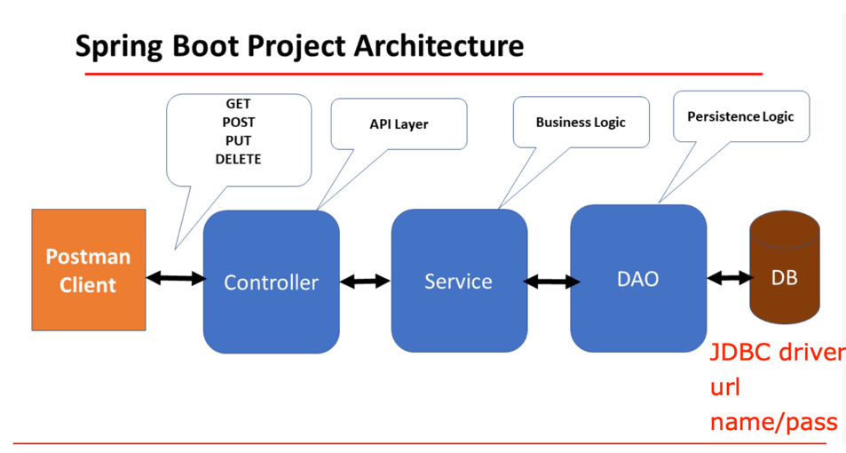

# HW7
## Spring Boot
1. create a file to list all the annotations you learned and know, and explain the usage and how do you understand it. you need to update it when you learn a new annotation. Please organize those annotations well, like annotations used by entity, annotations used by controller.
    1. Filename:annotations.md
    2. you'dbetteralsolistacodeexampleundertheannotations.

2. explain how the below annotations specify the table in database?
    ```java
    @Column(columnDefinition = "varchar(255) default 'John Snow'")
    private String name;
    @Column(name="STUDENT_NAME", length=50, nullable=false, unique=false)
    private String studentName;
    ```
   ```java
    @Column(columnDefinition = "varchar(255) default 'John Snow'")
    private String name;
    ```
   - This attribute provides a way to define the entire column definition directly. It tells the database to create this column as a VARCHAR type with a maximum length of 255 characters, and if no value is specified, the default value 'John Snow' will be used.
   ```java
    @Column(name="STUDENT_NAME", length=50, nullable=false, unique=false)
    private String studentName;
    ```
   - Explicitly define the column name in the database "STUDENT_NAME", column to 50 characters, not allow NULL values and duplicate values in different rows are allowed for this column.

3. What is the default column name of the table in the database for @Column?
    ```java
    @Column
    private String firstName;
    @Column
    private String operatingSystem;
    ```
   The column names would be first_name and operating_system, respectively.

4. What are the layers in springboot application? what is the role of each layer?
   
   | Layer              | Role                                                                                                                                                                                                                                                                                                                                                                                                           |
   |--------------------|----------------------------------------------------------------------------------------------------------------------------------------------------------------------------------------------------------------------------------------------------------------------------------------------------------------------------------------------------------------------------------------------------------------|
   | Presentation Layer | The presentation layer is the top layer of the spring boot architecture. It consists of Views. i.e., the front-end part of the application. It handles the HTTP requests and performs authentication. It is responsible for converting the JSON field’s parameter to Java Objects and vice-versa. Once it performs the authentication of the request it passes it to the next layer. i.e., the business layer. |
   | Business Layer     | The business layer contains all the business logic. It consists of services classes. It is responsible for validation and authorization.                                                                                                                                                                                                                                                                       |
   | Persistence Layer  | The persistence layer contains all the database storage logic. It is responsible for converting business objects to the database row and vice versa.                                                                                                                                                                                                                                                           |
   | Database Layer     | The database layer contains all the actual databases such as MySql, MongoDB, etc. This layer can contain multiple databases. It is responsible for performing the CRUD operations.                                                                                                                                                                                                                             |

5. Describe the flow in all the layers if an API is called by Postman.
   
   1. Postman Client
      **Initiation**: The journey starts with the Postman client, where you can create HTTP requests (GET, POST, PUT, DELETE) to interact with your Spring Boot application.
   2. Controller (API Layer)
      **Reception and Routing**: The controller receives the HTTP request from Postman. It determines what action to take based on the URL path and HTTP method.
   3. Service (Business Logic)
      **Business Operations**: After receiving data or commands from the controller, the service layer handles the core business logic of the application. This layer might involve calculations, data transformations, or business rule enforcement.
   4. DAO (Data Access Object - Persistence Logic)
      **Data Handling**: The DAO layer is tasked with accessing and manipulating the data stored in the database. It uses JDBC or an ORM framework like Hibernate to interact with the database.
   5. Database (DB)
      **Storage**: This is where all data relevant to your application is stored and retrieved from. The database could be a relational database like MySQL, PostgreSQL, or any other suitable storage system. The DB acts as the persistent storage mechanism for the application. It is accessed through the DAO layer using JDBC drivers and connection details (url, name, password).   

6. What is the application.properties? do you know application.yml?
   - application.properties
      The application.properties file in a Spring Boot application is a key component for configuration management. This file is typically located in the src/main/resources directory of a Spring Boot project.
   ```java
   /**
   Database Configurations: Details like the database URL, username, and password.
   Spring Data JPA Configurations: Hibernate settings, DDL mode (update, create-drop, etc.).
   Server Configurations: Port configuration, context path.
   Custom Application Configurations: Any custom configurations that your application needs.
    **/
   spring.application.name=xhs
   server.port=8080
   
   # datasource
   spring.datasource.url = jdbc:mysql://localhost:3306/mydb
   spring.datasource.username= root
   spring.datasource.password= password
   spring.jpa.hibernate.ddl-auto=update
   ```
   - application.yml
     application.yml is an alternative to application.properties and uses YAML (YAML Ain't Markup Language) format for configuration settings. YAML is considered more readable and provides better support for hierarchical data representation, making it a popular choice for configuration files.
   ```java
   server:
     port: 8080
   
   spring:
     datasource:
       url: jdbc:mysql://localhost:3306/mydb
       username: root
       password: secret
     jpa:
       hibernate:
         ddl-auto: update
   ```
   
7. Create a Project, name it with mongo-blog, write a POST API for mongo-blog, change databases to MongoDB;
    https://www.mongodb.com/compatibility/spring-boot
    https://start.spring.io/

## Postman practice
### GET
```json
//GET https://jsonplaceholder.typicode.com/users/1
{
        "id": 1,
        "name": "Leanne Graham",
        "username": "Bret",
        "email": "Sincere@april.biz",
        "address": {
        "street": "Kulas Light",
        "suite": "Apt. 556",
        "city": "Gwenborough",
        "zipcode": "92998-3874",
        "geo": {
        "lat": "-37.3159",
        "lng": "81.1496"
        }
        },
        "phone": "1-770-736-8031 x56442",
        "website": "hildegard.org",
        "company": {
        "name": "Romaguera-Crona",
        "catchPhrase": "Multi-layered client-server neural-net",
        "bs": "harness real-time e-markets"
        }
}
// GET https://api.github.com/users/github/repos
// GET https://dog.ceo/api/breeds/image/random
{
   "message": "https://images.dog.ceo/breeds/bakharwal-indian/Bakharwal.jpg",
   "status": "success"
}
```
### POST
```json
//Request Body
POST https://jsonplaceholder.typicode.com/posts
{
   "title": "foo"
}

//Response
{
"title": "foo",
"id": 101
}
```
```json
//Request Body
POST https://reqres.in/api/users
{
"name": "morpheus",
"job": "leader"
}

//Response
{
"name": "morpheus",
"job": "leader",
"id": "85",
"createdAt": "2024-07-01T20:05:36.148Z"
}
```
### PUT
```json
PUT https://jsonplaceholder.typicode.com/posts/1
{
   "id": 1,
   "title": "updated title",
   "body": "updated body",
   "userId": 1
}

{
   "id": 1,
   "title": "updated title",
   "body": "updated body",
   "userId": 1
}
```
### DELETE
```json
DELETE https://jsonplaceholder.typicode.com/posts/1

{}
```

