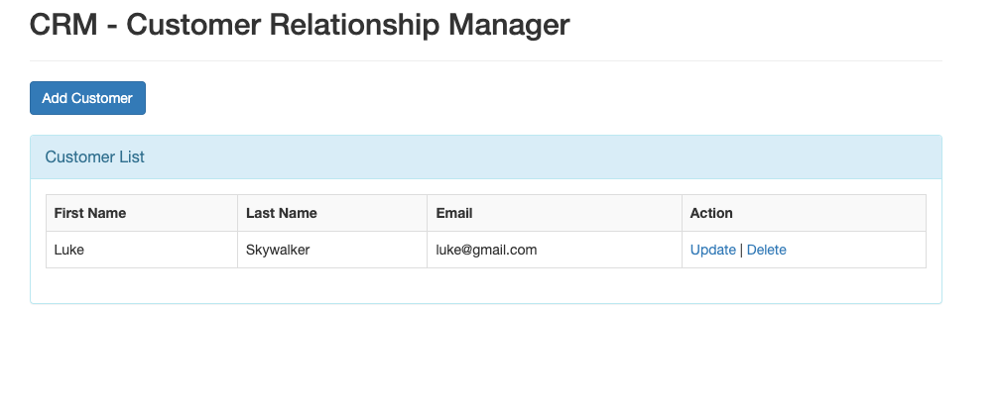

1.  List all of the annotations you learned from class and homework to annotaitons.md
2.  What is MVC pattern?
   - Model-View-Control Pattern
     - Model:
       - it's a container for data, used to transfer data from one part to another
     - View:
       - View template receives the model containing data, read the data from model and display the data.
     - Control: 
       - front controller maps the incoming request to a controller
       - Controller contains the business logic of the application
       - returns the model back to the front controller
3.  What is Front-Controller?
   - it is a design pattern that all requests for an application will be handled by a single handler and then dispatched to the appropriate handler for that type of request.
     
4.  What is DispatcherServlet? please describe how it works.
   - it is a core component of the Spring MVC framework, which acts as the Front-Controller in Spring Web application.
   - work flow
     1. Request Interception:
        when tomcat receives HTTP Request, DispacherServlet intercepts the HTTP request.
     2. Handler Mapping
        it uses configured **handlermapping** to find the appropriate handler controller for the request
     3. Handler Execution
        The request is passed to the chosen controller method for processing. The controller interacts with the service layer to perform business logic and prepares a ModelAndView object.
        often return view name, a string, like list-costomers, set the data to the model
     4. View Resolution
        The DispatcherServlet uses a ViewResolver to determine the view that should render the response based on the logical view name returned by the controller.
        find the view template, like list-customers.jsp
     5. Rendering the view
        The selected view renders the response (typically as HTML) and sends it back to the client.
     
5.  What is JSP and What is ModelAndView？(please google to have a basic knowlege)
    - JSP
      - Jakarta Server Pages
        - Java standard technology that developers use to write dynamic, data-driven web pages for Java web application.
      - ModelAndView
        - Holder for both Model and View in the web MVC framework
        
6.  Could you please google any other servlets(理解多少是多少，不要花太多时间，知道servlet的名字就行。)
    
7.  How many web server do you know? (Tomcat, Jetty, Jboss)
    Node.js with express
    Nginx
8. clone this repo, and run it in you local.
   1. https://github.com/CTYue/springmvc5-demo
   2. Notice that you need to configure the Tomcat by yourself. tutorial in the slides.
   3. find out the APIs in controlelr and call some APIs, In slides, I also list some API.
   4. remeber to create a database for this project
   5. all details in the slides.
      
