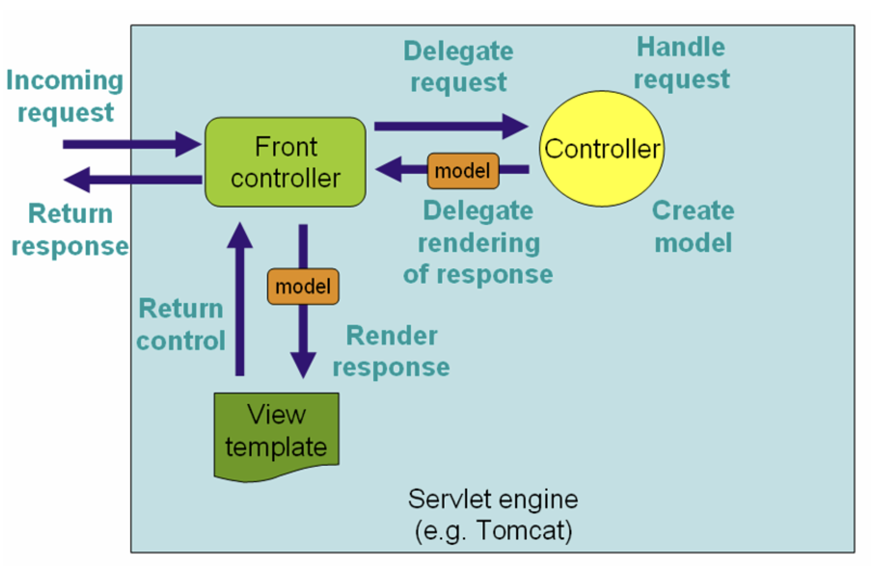
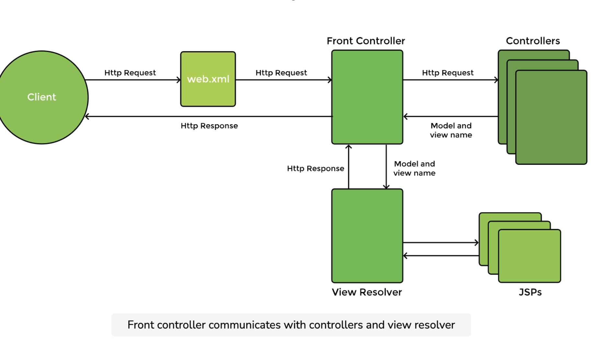

# HW12
1. List all of the annotations you learned from class and homework to annotaitons.md  
     
    see annotation.md [here](annotation.md)

2. What is MVC pattern?
   The MVC design pattern is a software architecture pattern that separates an application into three main components: Model, View, and Controller, making it easier to manage and maintain the codebase. It also allows for the reusability of components and promotes a more modular approach to software development.
    
3. What is Front-Controller?
   The front controller maps the incoming request to a controller. Controllers contain the business logic of the application. They also handle requests and perform marshalling/ unmarshalling. The function of the controller is to handle a user request. The incoming request may be handled in different ways like reading form data, processing it in some way, storing data in a database, or retrieving data from a web service etc. The controller places the data in the model which, simply put, is a container for the data. The controller returns the model (containing data) back to the front controller.
   
4. What is DispatcherServlet? please decribe how it works.
    > Essentially, a DispatcherServlet handles an incoming HttpRequest, delegates the request, and processes that request according to the configured HandlerAdapter interfaces that have been implemented within the Spring application along with accompanying annotations specifying handlers, controller endpoints, and response objects.
   
   * DispatcherServlet abstracts away the following tedious and boilerplate tasks and focus on useful business logic:
       Mapping an HTTP request to a certain processing method
       Parsing of HTTP request data and headers into data transfer objects (DTOs)or domain objects Model-view-controller interaction
       Generation of responses from DTOs, domain objects, etc

   * The workflow of the DispatcherServlet in Spring MVC involves several distinct phases:
      - **Request Reception**: The DispatcherServlet first receives an HTTP request.
      - **Handler Mapping**: It uses one or more handler mapping strategies to determine which controller should process the request. Spring provides various ways to define mappings, but typically they are defined via @RequestMapping annotations on controller methods.
      - **Handler Execution**: Once a handler is identified, the DispatcherServlet passes the request to the appropriate controller. The controller then handles the request by executing its logic and returning a ModelAndView object, which contains model data and the name of the view.
      - **View Resolution**: After the controller finishes execution, the DispatcherServlet uses a ViewResolver to resolve the logical view name into an actual view. A view might be a JSP or any other form of presentation data like JSON, XML, etc.
      - **Response Rendering**: The chosen view then renders the response, using the model data provided by the controller. This rendered view is what is sent back to the client.
   
     
5. What is JSP and What is ModelAndView? (please google to have a basic knowlege)
   > **JSP (JavaServer Pages)** is a server-side technology that helps in creating dynamically generated web pages based on HTML, XML, or other document types.
   > **ModelAndView** is a class in Spring MVC that works as a container for both model data and view information. It is used within Spring MVC's handler methods and serves to pass both the model data and information about the view back to the Spring front controller (DispatcherServlet).
    
6. Could you please google any other servlets（理解多少是多少，不要花太多时间，知道servlet的名字就行。  
   JspServlet, GenericServlet, HttpServlet, WebSocket Servlets, Filter and Listener Servlets.
   
7. How many web servers do you know? (Tomcat, Jetty, Jboss)
   Nginx, LiteSpeed, Node.js, Caddy, Microsoft Internet Information Services (IIS)
8. clone this repo, and run it in you local.
   1. https://github.com/CTYue/springmvc5-demo
   2. Notice that you need to configure the Tomcat by yourself. tutorial in the slides.
   3. find out the APIs in the controller and call some APIs, In slides, I also list some API.
   4. remember to create a database for this project
   5. all details in the slides.