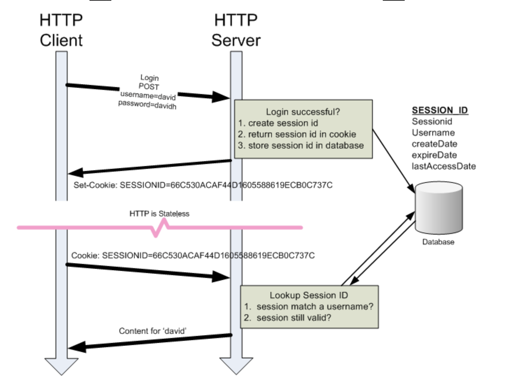

1. List all of the annotations you learned from class and homework to annotaitons.md
2.  Explain TLS, PKI, certificate, public key, private key, and signature.
    - TLS: Transport Layer Security
      - is a protocol that ensures privacy between communication applications and users on the internet.
    - PKI: Public Key Infrastructure
      - is a framework for create, manage, distribute, use, store and revoke certificates and manage public-key encryption.
    - Certificate
      - is a diginal document that uses a digital signature to bind a public key with identity-information.
      - such as name of a person or an organization, the addresss.
    - Public Key
      - one of the two keys used in asymmetric encryption algorithm. used to encyrpt data.
      - holds by users
    - Private Key
      - another half of key used in asymmetric encryption algorithm. kept secret, decrypt data
      - holds by server
    - Signature
      - validate data integrity and sender authentity.
      - a cryptographic value that is calculated from the data and a private key.
      - used to verify the authenticity and integrity of a message.
      - when the message is signed with a private key, anyone with the corespoding public key can verify that message.
      

3.  list all http status codes that related to authentication and authorization failures.
    - 401 unauthorized
    - 403 forbidden
    - 407 proxy authentication required

4.  Compare authentication and authorization?
    - Authentication
      - authentication is the process of verifying the identity of a user or entity.
    - Authorization
      - is the process of determining a authenticated user or entity has permission to access a specific resource.
      
5.  What is HTTP Session?
    - is a mechanism used to persist user data across multiple HTTP requests.
    - make HTTP be stateful.

6.  What is Cookie?
   - a small piece of data sent from website server and stored on user's device by their web browers.
   - Cookies are used to remember information about hte user, like the preference, login status, session information.

7.  What is the difference between Session and Cookie?
    
    | Feature            | Cookies                                 | Sessions                                              |
    |--------------------|-----------------------------------------|-------------------------------------------------------|
    | Storage Location   | User side                               | server side                                           |
    | Size limit         | limited to 4kb                          | no strict size limit, depends on server configuration |
    | Security           | less scecure, can be change             | more secure, reduce exposure to client-side attacks   |
    | Communication      | Sent with every HTTP request            | identified by a seesionID                             |
    | Performance Impact | Minimal overhead since cookie are small | can be heavier on the server side as data grows       |

8.  How do we use session and cookie to keep user information across the the application?
    1. client login, the server will generate session id, and send back to client
    2. client send request with session id in the following HTTP request, server look up the data from the database to authenticate the user.
    
    
9.  What is JWT?
    - JSON Web Token, is an open standerd for security transimitting information between parties as a JSON object.
    - commonly used for authentication and authorization in web applications, allowing the servers to verify the identity fo a client and grant access to protected resources.
    - inlucing three parts. header, payload and signature
      - header: The header typically consists of two parts: the type of token (JWT) and the signing algorithm being used (such as HMAC SHA256 or RSA).
      ```
      {
        "alg": "HS256",
        "typ": "JWT"
        }
      ```
      - payload: The payload contains the claims, which are statements about an entity (typically, the user) and additional data.
      ```
      {
        "sub": "1234567890",         // Subject (user identifier)
        "name": "John Doe",          // User's name
        "admin": true,               // Boolean claim indicating admin status
        "roles": ["user", "admin"],  // Array of roles assigned to the user
        "email": "john.doe@example.com",  // User's email address
        "exp": 1641025200,           // Expiration time (Unix timestamp)
        "iat": 1641021600,           // Issued at (Unix timestamp)
        "iss": "https://example.com", // Issuer
        "aud": ["https://api.example.com", "https://app.example.com"]  // Audience
        }

      ```
      - Sinature
        - To create the signature part, you have to take the encoded header, the encoded payload, a secret, the algorithm specified in the header, and sign that.
10.  What is the spring security filter?
     - The filter chain is a series of servlet filters that intercept incoming requests and apply various security checks before the request reaches your application's endpoints.

11.  Explain how JWT works
     - work flow
     
     - decode
     

12.  Explain how do we store sensitive user information such as password and credit card number in DB?
     - Salt Algorithm
       - in database, save hash and salt,  hash(password + salt)
         - irreversible, only (password + salt) = hash, from hash and salt, cannot decode to get password
       - Bcrypt: can generate random salt
         - bcrypt(password) = bcrypt(password)
     
13.  Compare UserDetailService, AuthenticationProvider, AuthenticationManager, AuthenticationFilter?(把这几
     个名字看熟悉也行)
14.  What is the disadvantage of Session? how to overcome the disadvantage?
     - disadvantage
         - server side storage
         - scalability concerns (it is stateful)
         - performance impact
         - session management overhead
     - improve
       - stateless authentication (JWT)
       - add cache
       - implement session expiry and clean up mechanism

15.  how to get value from application.properties in Spring security?
     - using @Value annotation
     ```
     // application.properties
        security.jwt.secret=your_secret_key_here
        
     // get data
        @Value("${security.jwt.secret}")
        private String jwtSecret;
     ```

16.  What is the role of configure(HttpSecurity http) and configure(AuthenticationManagerBuilder auth)?
     - ways to configure different aspects of security in the application.
     - configure(HttpSecurity http
       - part of WebSecurityConfigurerAdapter
       -  such as authorization rules, login/logout configurations, CSRF protection, session management, etc.
       ```
       @Configuration
       @EnableWebSecurity
        public class SecurityConfig extends WebSecurityConfigurerAdapter {

        @Override
        protected void configure(HttpSecurity http) throws Exception {
            http
                .authorizeRequests()
                    .antMatchers("/public/**").permitAll()
                    .antMatchers("/admin/**").hasRole("ADMIN")
                    .anyRequest().authenticated()
                    .and()
                .formLogin()
                    .loginPage("/login")
                    .defaultSuccessUrl("/dashboard")
                    .permitAll()
                    .and()
                .logout()
                    .logoutUrl("/logout")
                    .logoutSuccessUrl("/login?logout")
                    .permitAll();
        }
        }
       ```
     - configure(AuthenticationManagerBuilder auth)
       - also part of WebSecurityConfigurerAdapter
       - It defines where user information is stored (e.g., in-memory, database) and how authentication is performed (e.g., using LDAP, JDBC).
       ```
        @Configuration
        @EnableWebSecurity
        public class SecurityConfig extends WebSecurityConfigurerAdapter {
        
            @Autowired
            private UserDetailsService userDetailsService;
        
            @Override
            protected void configure(AuthenticationManagerBuilder auth) throws Exception {
                auth
                    .userDetailsService(userDetailsService)
                    .passwordEncoder(passwordEncoder());
            }
        
            @Bean
            public PasswordEncoder passwordEncoder() {
                return new BCryptPasswordEncoder();
            }
        }

       ```
17.  What is Spring security authentication and authorization?
     - Authentication verifies the identity of the user.
     - Authorization determines what actions or resources the authenticated user is permitted to access.

18.  Reading, 泛读一下即可，自己觉得是重点的，可以多看两眼。https://www.interviewbit.com/spring-security-i
     nterview-questions/#is-security-a-cross-cutting-concern
    1.  1-12
    2.  17 - 30