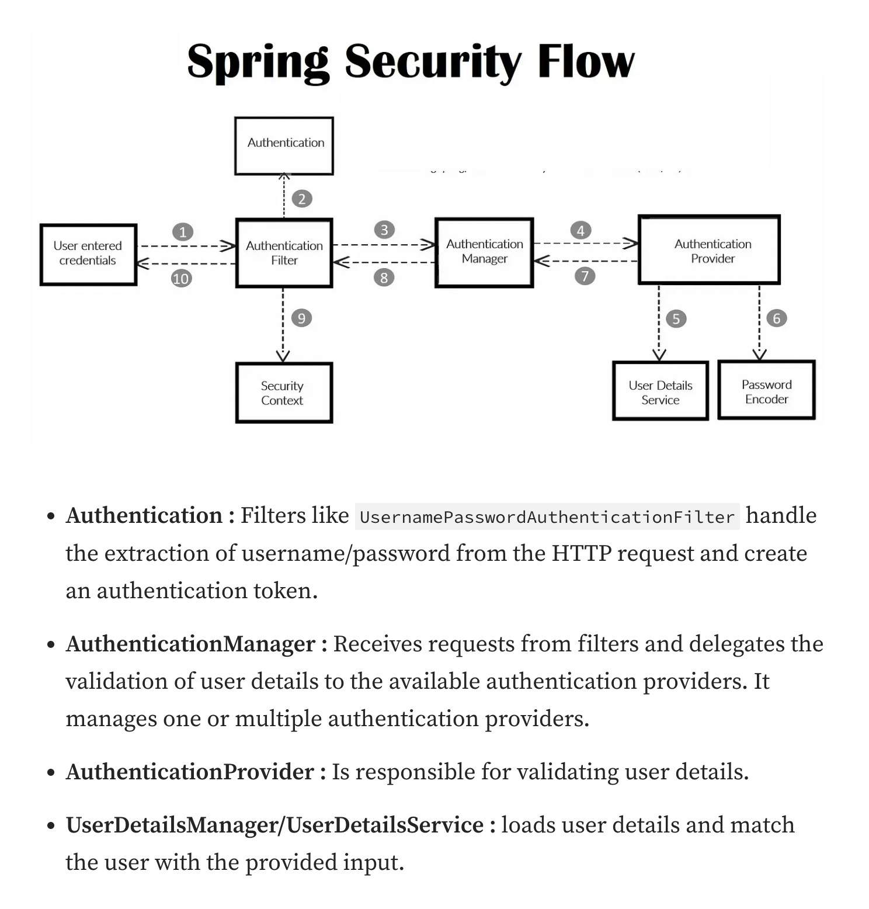

# HW13
1. List all the annotations you learned from class and homework to annotation.md  
   see annotation.md [here](annotation.md)
2. Explain TLS, PKI, certificate, public key, private key, and signature.
    - **TLS**: TLS is a protocol that provides secure communication over a computer network. When a web browser (client) and a server communicate, TLS ensures that the data exchanged remains confidential and secure. It prevents eavesdropping, tampering, and message forgery. TLS is **the successor to SSL** (Secure Sockets Layer) and is widely used in applications like web browsing, email, instant messaging, and voice over IP.
    - **PKI**: PKI is a framework used to create, manage, distribute, use, store, and revoke **digital certificates**. It involves roles, policies, hardware, software, and procedures needed to create, manage, distribute, use, store, and revoke digital certificates and manage **public-key encryption**. The purpose of a PKI is to facilitate the secure electronic transfer of information for a range of network activities such as e-commerce, internet banking, and confidential email.
    - **Certificate**: A digital certificate is an electronic document used to **prove the ownership of a public key**. The certificate includes information about the key, the identity of its owner (including email address, location, etc.), and the digital signature of an entity that has verified the certificate's contents, usually a trusted third party known as a Certificate Authority (CA). Certificates act as a form of digital passport or credential.
    - **Public Key and Private Key**: These are a pair of keys used in public-key cryptography, which is the foundation for many security protocols, including TLS and PKI. The public key is shared with anyone, while the private key is kept secret. The public key can be used to encrypt data that only the private key can decrypt, or it can be used to verify a digital signature made with the private key.
    - **Signature**: A digital signature is a mathematical scheme for demonstrating the authenticity of digital messages or documents. A valid digital signature gives a recipient reason to believe that the message was created by a known sender (authentication), that the sender cannot deny having sent the message (non-repudiation), and that the message was not altered in transit (integrity). Digital signatures are commonly used for software distribution, financial transactions, and in other cases where it is important to detect forgery or tampering.
3. list all http status codes that related to authentication and authorization failures.

    | status code                           | explanation                                                                                                 |
    |---------------------------------------|-------------------------------------------------------------------------------------------------------------|
    | **401 Unauthorized**                  | The request has not been applied because it lacks valid authentication credentials for the target resource. |
    | **403 Forbidden**                     | The server understands the request but refuses to authorize it.                                             |
    | **407 Proxy Authentication Required** | Similar to 401, but it indicates that the client must first authenticate itself with the proxy.             |

4. Compare authentication and authorization?
   - In the authentication process, users’ identities are verified to grant access to the system, (**login username password**)
   - whereas in the authorization process, a person’s or user’s permissions are verified to access resources. (**user’s privilege or security levels**)
   - Authentication precedes the authorization process, while the authorization process occurs after authentication.
    
5. What is HTTP Session? 
    
    HTTP sessions is an industry standard feature that allows Web servers to maintain user identity and to store user-specific data during multiple request/response interactions between a client application and a Web application. HTTP sessions preserves:
      - Information about the session itself (session identifier, creation time, time last accessed, etc.)
      - Contextual information about the user (client login state, for example, plus whatever else the Web application needs to save)
   
   The Tomcat servlet container, which is built into PAS for OpenEdge, provides HTTP sessions as the default method for preserving session and contextual information.
    
6. What is Cookie?
   - Cookies (often known as internet cookies) are text files with small pieces of data — like a username and password — that are used to identify your computer as you use a network. 
   - Specific cookies are used to identify specific users and improve their web browsing experience. 
   - Data stored in a cookie is created by the server upon your connection. This data is labeled with an ID unique to you and your computer. When the cookie is exchanged between your computer and the network server, the server reads the ID and knows what information to specifically serve you.
7. What is the difference between Session and Cookie?

    | Session                                                                                                                                              | Cookie                                                                        |
    |------------------------------------------------------------------------------------------------------------------------------------------------------|-------------------------------------------------------------------------------|
    | Sessions are server-side files that contain user data.                                                                                               | Cookies are client-side files on a local computer that hold user information. |
    | We can keep as much data as we like within a session, however there is a maximum memory restriction of 128 MB that a script may consume at one time. | The browser’s cookies have a maximum capacity of 4 KB.                        |
    | Session are more secured compare than cookies, that save data in encrypted form.                                                                     | Cookies are not secured as storing data in text file                          |

8. How do we use session and cookie to keep user information across the application?
   
    Example of a user logging into an e-commerce website:
    - Login: User enters credentials; the server validates them and **creates a new session** with a unique session ID.
    - Cookie Sent: The server **sends this session ID back in a cookie** marked as HttpOnly and Secure.
    - Browsing: As the user browses, adds items to the cart, or adjusts settings, each HTTP request from their browser includes the session cookie.
    - Persistent State: The server **retrieves session data** using the session ID, allowing the user to see their cart items and settings without re-authenticating or reconfiguring them with each page load.
    1. **Cookie Creation and Session Initialization**
      
         When a user first logs into an application or accesses it in a way that requires maintaining their state, the server generates a unique session identifier (session ID). This session ID is then sent to the user’s browser in the form of a cookie.

         Cookie: A small piece of data stored in the user’s browser.
         Session ID: A unique identifier that links the cookie with session data stored on the server.
    2. **Storing Session Data**
      
       On the server, session data associated with the session ID is stored. This data can include user-specific information such as user ID, preferences, authentication tokens, and other relevant details necessary to maintain the user’s state across the application.
       - Server-side Storage: This is typically implemented using a session store, which could be in-memory, a database, or other storage mechanisms.
    3. **Client-Server Interaction**
       Each time the user makes a subsequent request to the server, the browser automatically sends the cookie containing the session ID with the request. The server retrieves the session ID from the cookie, looks up the session store to retrieve the user’s session data, and uses this information to handle the request appropriately.
    4. **Maintaining Security**
       - HttpOnly: This attribute can be set on cookies to prevent client-side access to the cookie via JavaScript. It helps mitigate the risk of cross-site scripting (XSS) attacks.
       - Secure: Setting the Secure attribute on cookies ensures they are only sent over HTTPS, protecting the data from being intercepted during transmission.
       - Session Expiration: Sessions should have an expiration mechanism to limit the duration for which a session is valid. This can protect against issues like session hijacking.
    5. **Session Termination**
       When the user logs out or after a certain period of inactivity, the session should be explicitly terminated. This involves both deleting the session data from the server's session store and instructing the client’s browser to delete the cookie.
    6. **Renew Session ID**
       To enhance security, particularly after a user logs in or changes sensitive account settings, it's a good practice to renew the session ID. This helps prevent session fixation attacks where an old session ID might be reused maliciously.

9. What is JWT?  
   A JSON web token(JWT) is JSON Object which is used to securely transfer information over the web(between two parties). It can be used for an authentication system and can also be used for information exchange. The token is mainly composed of header, payload, signature. These three parts are separated by dots(.). JWT defines the structure of information we are sending from one party to the another, and it comes in two forms – Serialized, Deserialized. The Serialized approach is mainly used to transfer the data through the network with each request and response. While the deserialized approach is used to read and write data to the web token.
10. What is the spring security filter?  
    The Security Filters are inserted into the FilterChainProxy with the SecurityFilterChain API. Those filters can be used for a number of different purposes, like authentication, authorization, exploit protection, and more. The filters are executed in a specific order to guarantee that they are invoked at the right time, for example, the Filter that performs authentication should be invoked before the Filter that performs authorization. It is typically not necessary to know the ordering of Spring Security’s Filters. However, there are times that it is beneficial to know the ordering, if you want to know them, you can check the FilterOrderRegistration code.
    [more in link](https://docs.spring.io/spring-security/reference/servlet/architecture.html#servlet-security-filters)
11. Explain how JWT works
    > JWTs work by encoding a set of claims into a compact, URL-safe string. This string can be easily transmitted over the network and verified by the receiver. [more in link](https://www.descope.com/learn/post/jwt)
    1. The issuer of the JWT creates a new JWT object and sets the claims that it wants to include in the token.

    2. The issuer signs the JWT object using a secret key or a public/private key pair.

    3. The resulting JWT is a compact, URL-safe string that can be transmitted over the network.

    4. The receiver of the JWT verifies the signature of the JWT using the secret key or the public key.

    5. If the signature is valid, the receiver can trust the claims in the JWT.
12. Explain how we store sensitive user information such as password and credit card number in DB?
    - For password: Use a strong, slow cryptographic hash function designed for passwords, such as bcrypt, scrypt, or Argon2. These algorithms are resistant to brute force attacks and are specifically designed to slow down cracking attempts.
    - For Credit Card Numbers: Follow the Payment Card Industry Data Security Standard (PCI DSS) requirements if you are handling credit card information. This standard provides a framework for securing credit card data and includes requirements for encryption, access control, vulnerability management, and regular security assessments.
13. Compare UserDetailService, AuthenticationProvider, AuthenticationManager, AuthenticationFilter?(把这几个名字看熟悉也行)
    - UserDetailsService: Retrieves detailed user information from a specified source (e.g., a database).
    - AuthenticationProvider: Performs the actual authentication check to verify credentials.
    - AuthenticationManager: Orchestrates the authentication process by passing credentials to the appropriate provider.
    - AuthenticationFilter: Sits at the front of the authentication pipeline, captures user credentials from HTTP requests, and initiates the authentication process.
14. What is the disadvantage of Session? how to overcome the disadvantage?
    1. Scalability Issues: Sessions are typically stored in the server's memory, which can lead to scalability issues as the number of concurrent users increases. This is particularly challenging in distributed environments where the application is deployed across multiple servers.
    2. Performance Overhead： Managing a large number of sessions can consume significant server resources, affecting the overall performance of the application.
    3. Security Risks: Sessions can be vulnerable to various attacks, including session hijacking and session fixation.
15. how to get value from application.properties in Spring security?
    > In a Spring Boot application, application.properties is the central repository for defining configuration properties. These properties are accessible across the application to customize behavior. Accessing values from application.properties is a common requirement in Spring Boot projects.

    Spring Boot automatically loads properties from application.properties files in the classpath. To access these properties in Spring components, we use annotations like @Value or the Environment object provided by Spring.
    ```properties
    spring.application.name=spring-value-demo
    
    # Properties of the app title
    app.title=My Spring Boot App
    ```
    ```java
    @RestController
    public class ExampleController {
    
        @Value("${app.title}") // Injecting the value of app.greeting from application.properties
        private String greeting;
    
        @GetMapping("/greet")
        public String greet() {
            return greeting; // Return the value of app.greeting
        }
    }
    ```
    ```java
    @SpringBootApplication
    public class SpringValueDemoApplication {
    
        public static void main(String[] args) {
    
    
            SpringApplication.run(SpringValueDemoApplication.class, args);
    
        }
    }
    ```
16. What is the role of configure(HttpSecurity http) and configure(AuthenticationManagerBuilder auth)?
    | configure(HttpSecurity http) | configure(AuthenticationManagerBuilder auth) |
    | ---- | ---- |
    | configure web-based security for specific http requests | establish an authentication mechanism by specifying where and how the user details are obtained and how the passwords are encoded. |
    | Authorization, Authentication, Form Login/Logout, Session Management | UserDetailsService, Password Encoding, Authentication Provider |
17. What is Spring security authentication and authorization?
    refer to question4 and the img
18. Reading,泛读一下即可，自己觉得是重点的，可以多看两眼。https://www.interviewbit.com/spring-security-i nterview-questions/#is-security-a-cross-cutting-concern
    1. 1-12 
    2. 17-30