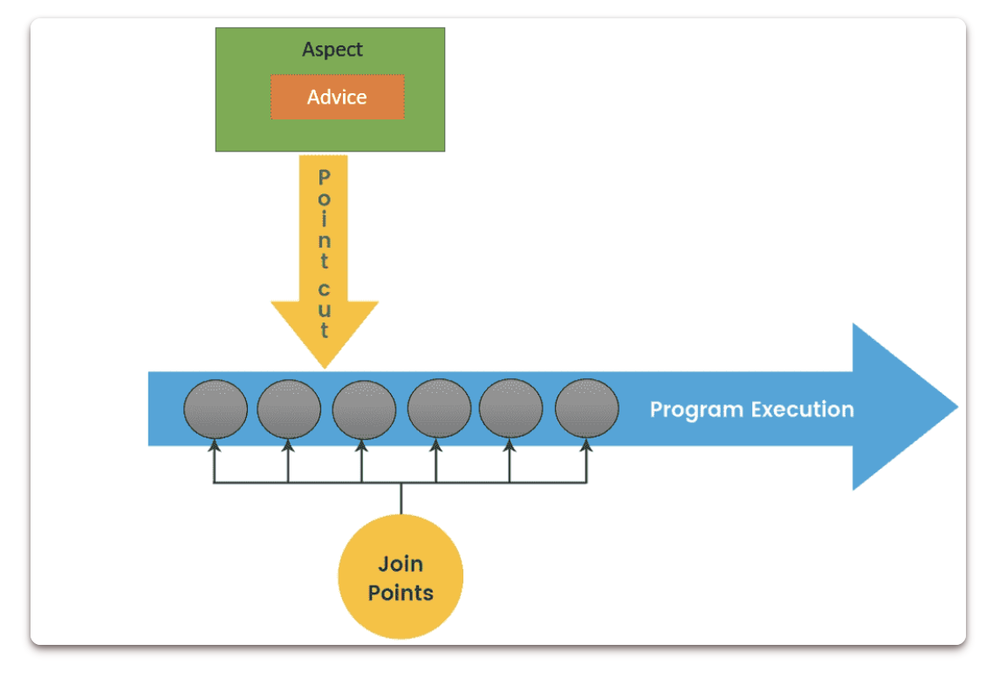

1.  List all of the annotations you learned from class and homework to annotaitons.md
2.  Briefly reading: https://www.techgeeknext.com/spring-boot/spring-aop-interview-questions
3.  What is the Aspect Oriented Programming, explain it with detailed use cases?
    - is a programming technique that support separation of cross-cutting concerns in order to increase modularity.
    - use case
      - Logging
      - Security
      - Transaction Management
4.  What are the advantages and disadvantages of Spring AOP?
    - Advantage
      - easy to configure
      - Spring AOP is implemented with pure Java, separate complilation unit or seprate calss loader are not required
      - use Spring IOC Container for dependency inject
      - Can create aspects using @AspectJ annotation based or using XML based.
      - it integrate cross-cutting concerns into the classes
    - disadvantages
      - debug of AOP framework-based application code is a little bit challenging
      - only methods with public visibility will be recommend, not with other scope
      - aspects cannot be advised by other aspects
5.  Explain following concept in your own words, you may include code snippet as part of your answer.
    
    - Aspect
      - a cross-cutting module that combines advice and pointcuts
      - using @Aspect
    - PointCut 
      - is an expression that choose one or more join points at which advice is given
    - JoinPoint 
      - where the AOP aspect is applied
    - Advice
      - an action which we take before of after the method execution
      - before, after, after-returning, after-throwing, around advice
    ```
    @Aspect
    public class LoggingAspect {
    
        @Before("execution(* com.example.service.*.*(..))")
        public void logBefore(JoinPoint joinPoint) {
            System.out.println("Logging before method: " + joinPoint.getSignature().getName());
        }
    
        @After("execution(* com.example.service.*.*(..))")
        public void logAfter(JoinPoint joinPoint) {
            System.out.println("Logging after method: " + joinPoint.getSignature().getName());
        }
    
        @Around("execution(* com.example.service.*.*(..))")
        public Object logAround(ProceedingJoinPoint joinPoint) throws Throwable {
            System.out.println("Logging around method: " + joinPoint.getSignature().getName());
            Object result = joinPoint.proceed(); // Proceed with the method execution
            System.out.println("Logging around method after execution: " + joinPoint.getSignature().getName());
            return result;
        }
    }
    ```
6.  How do we declare a pointcut, can we declare it without annotating an empty method? Name some
    expressions to do it.
    - using annotation on advice methods
    ```
    @Aspect
    public class LoggingAspect {

    @Before("execution(* com.example.service.*.*(..))")
    public void logBefore(JoinPoint joinPoint) {
        System.out.println("Logging before method: " + joinPoint.getSignature().getName());
    }

    @After("execution(* com.example.service.*.*(..))")
    ...

    @Around("execution(* com.example.service.*.*(..))")
    ...
    }
    ```
    - using @Pointcut
    ```
    @Aspect
    public class LoggingAspect {
    
        @Pointcut("execution(* com.example.service.*.*(..))")
        public void serviceLayerExecution() {
            // This method is empty because it's used as a pointcut expression.
        }
    
        @Before("serviceLayerExecution()")
        public void logBefore(JoinPoint joinPoint) {
            ...
        }
    
        @After("serviceLayerExecution()")
        public void logAfter(JoinPoint joinPoint) {
            ...
        }
    
        @Around("serviceLayerExecution()")
        public Object logAround(ProceedingJoinPoint joinPoint) throws Throwable {
            ...
        }
    }
    ```
7.  Compare different types of advices in Spring AOP.
    - @Before
      - Executed before the matched join point (usually a method execution).
    - @After
      - Executed after the matched join point, regardless of the outcome (whether normal return or exception).
    - @AfterReturning
      - Executed after the matched join point completes normally (without throwing an exception).
    - @AfterThrowing
      - Executed if the matched join point throws an exception.
    - @Around
      - Surrounds a matched join point, allowing the advice to execute before and after the join point, and even control whether the join point executes at all.
    
8.  Reading: https://www.javainuse.com/spring/sprbatch_interview
    
9.  Spring WebFlux vs Stream API+CompletableFuture, why use Spring WebFlux over the other?
    - both asynchronous, non-blocking programming in Java
    - Spring WebFlux
      - Reactive Programming: Built on Project Reactor, it provides a reactive programming model.
      - Non-blocking I/O: Uses non-blocking I/O to handle requests and responses.
      - Web Framework: Designed for building scalable, non-blocking web applications and RESTful APIs.
      - Backpressure Support: Handles backpressure natively, which is crucial for managing load in reactive systems.
      - Declarative: The programming model is more declarative and functional.
      - Integration: Seamlessly integrates with other Spring components and the broader Spring ecosystem.
      - Performance: Excellent for high-throughput, low-latency applications where scalability is crucial.
    - Stream API with CompletableFuture
      - Asynchronous Programming: CompletableFuture provides a way to write asynchronous, non-blocking code.
      - Streams: Java Streams are useful for processing collections of data in a functional style.
      - Limited Scope: Primarily useful for concurrent operations and batch processing, rather than for building entire web frameworks.
      - Imperative: More imperative and less declarative compared to reactive streams.
      - Integration: Doesn't inherently provide the integration capabilities of a framework like Spring WebFlux.
      - Complexity: Managing backpressure and other concerns manually can be complex and error-prone.
      
10.  When to use Spring Batch? please provide detailed exaples with business context.
     - ETL(extract, transform, load) Process
       -  A retail company wants to consolidate sales data from various stores into a central data warehouse for better business intelligence.
     - Data Migration
       - A bank needs to migrate customer data from an outdated database to a new system, ensuring data integrity and completeness.
     - Batch Reporting
     - Data Cleanup
11.  How does Spring Batch work? you may include code snippet as part of your answer.
     - Define a Job: a job is composed of steps, eac step defines a reader, a processor, and a writer. 
     - Configure Steps: Each step is a phase in the batch process and typically consist of reading data, processing data, and writing data.
     - Launch the Job: Jobs are launched using a JobLauncher
12.  How can we schedule a Spring Batch Job?
     - With Spring Task
     ``` 
     @EnableSchduling
     @Scheduled(cron = "* * * * * *")
     @Scheduled(cron = "* * 7 * * 1,2,4")
     ```
13.  What is the cron expression?
     - Second(0-59), Minute(0-59), Hour(0-23), Day of Month, Month, Day of Week, Year
     
14.  Explain Spring task?
     - Spring Task is a feature provided by the Spring Framework for scheduling and running tasks in the background, enabling the execution of tasks at specified intervals or at specific times.

15.  What is Filter and any filter example?
     - a filter is a component that performs filtering tasks on either the request to a resource (such as a servlet or a static file) or on the response from a resource, or both.
 
16.  What is the Interceptor? What we can do with interceptor?
     - an interceptor is a component that allows you to intercept HTTP requests and responses at various stages of their processing.
     - Interceptors in Spring MVC offer a powerful mechanism for handling cross-cutting concerns and manipulating requests and responses in a flexible and reusable manner. Here are some common use cases and functionalities that can be achieved with interceptors:
17.  In Interceptor, What is preHandle? What is postHandle?
     - The preHandle method is invoked before the actual handler method of the controller is executed.
     - The postHandle method is invoked after the handler method of the controller has been invoked but before the view is rendered.