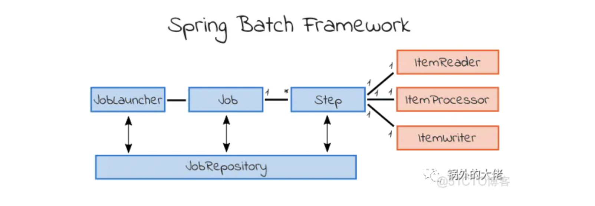

1.  List all of the annotations you learned from class and homework to annotaitons.md
2.  Briefly reading: https://www.techgeeknext.com/spring-boot/spring-aop-interview-questions
3.  What is the Aspect Oriented Programming, explain it with detailed use cases?
    - is a programming technique that support separation of **cross-cutting concerns** in order to increase modularity.
    - use case
      - Logging
      - Tracing
      - Exception Handling
      - Security Management
      - Application Monitoring
4.  What are the advantages and disadvantages of Spring AOP?
    - Advantage
      - easy to configure
      - Spring AOP is implemented with pure Java, separate complilation unit or seprate calss loader are not required
      - use Spring IOC Container for dependency inject
      - Can create aspects using @AspectJ annotation based or using XML based.
      - it integrate cross-cutting concerns into the classes
    - disadvantages
      - debug of AOP framework-based application code is a little bit challenging
      - only methods with public visibility will be recommend, not with other scope
      - aspects cannot be advised by other aspects
5.  Explain following concept in your own words, you may include code snippet as part of your answer.
    
    - Aspect
      - using @Aspect
      - Similar to @ControllerAdvice
      - combines advice and pointcuts
    - PointCut 
      - A pointcut defines at what join points, the associate Advice should be applied. 
    - JoinPoint 
      - where the AOP aspect is applied
    - Advice
      - an action which we take before of after the method execution
      - before, after, after-returning, after-throwing, around advice
    ```
    @Aspect
    public class LoggingAspect {
    
        private static final Logger logger = LoggerFactory.getLogger(WebAspect.class);
    
        // 定义一个切入点表达式，拦截com.example.service包中的所有方法
        @Pointcut("execution(* com.example.springaop.service.*.*(..))")
        public void serviceLayer() {
            // 切入点方法没有实现，因为它只是一个标识
        }
    
        @Before("serviceLayer()")
        public void logBefore(JoinPoint joinPoint) {
            logger.info("Inside WebAspect @Before");
            logger.info("Executing method: " + joinPoint.getSignature().getName());
            logger.info("Method arguments: " + Arra fdSsys.toString(joinPoint.getArgs()));
        }
    
        @AfterReturning(pointcut = "serviceLayer()", returning = "result")
        public void logAfterReturning(JoinPoint joinPoint, Object result) {
            logger.info("Inside WebAspect @AfterReturning");
            logger.info("Method: " + joinPoint.getSignature().getName() + " returned with value: " + result);
        }

    }
    ```
6.  How do we declare a pointcut, can we declare it without annotating an empty method? Name some
    expressions to do it.
    - Yes, we can define without empty method
      - execution(modifiers-pattern? ret-type-pattern declaring-type-pattern? name-pattern(param-pattern) throws-pattern?)
        - Matches any method execution within any class in the com.example.service package
          - execution(* com.example.service.*.*(..))
      - Annotation
        - Matches any method annotated with @MyAnnotation.
          - @annotation(com.example.annotation.MyAnnotation)
        - Matches any join point within types annotated with @MyAnnotation.
          - within(@com.example.annotation.MyAnnotation *)
    - Ways to define pointcut
    - using annotation on advice methods
    ```
    @Aspect
    public class LoggingAspect {

    @Before("execution(* com.example.service.*.*(..))")
    public void logBefore(JoinPoint joinPoint) {
        System.out.println("Logging before method: " + joinPoint.getSignature().getName());
    }

    @After("execution(* com.example.service.*.*(..))")
    ...

    @Around("execution(* com.example.service.*.*(..))")
    ...
    }
    ```
    - using @Pointcut
    ```
    @Aspect
    public class LoggingAspect {
    
        @Pointcut("execution(* com.example.service.*.*(..))")
        public void serviceLayerExecution() {
            // This method is empty because it's used as a pointcut expression.
        }
    
        @Before("serviceLayerExecution()")
        public void logBefore(JoinPoint joinPoint) {
            ...
        }
    
        @After("serviceLayerExecution()")
        public void logAfter(JoinPoint joinPoint) {
            ...
        }
    
        @Around("serviceLayerExecution()")
        public Object logAround(ProceedingJoinPoint joinPoint) throws Throwable {
            ...
        }
    }
    ```
7.  Compare different types of advices in Spring AOP.
    - @Before
      - Executed before the matched join point (usually a method execution).
    - @After
      - Executed after the matched join point, regardless of the outcome (whether normal return or exception).
    - @AfterReturning
      - Executed after the matched join point completes normally (without throwing an exception).
    - @AfterThrowing
      - Executed if the matched join point throws an exception.
    - @Around
      - Surrounds a matched join point, allowing the advice to execute before and after the join point, and even control whether the join point executes at all.
    
8.  Reading: https://www.javainuse.com/spring/sprbatch_interview
    
9.  Spring WebFlux vs Stream API+CompletableFuture, why use Spring WebFlux over the other?
    - 高并发场景 (high concurrency), 需要许多线程来handle request
    - a lot of I/O, eg 调用别的API, 读取数据库和文件等
    - why use WebFlux
    
    |                             | WebFlux                                                                                                      | Stream API +CompletableFuture                                                                                              |
    |-----------------------------|--------------------------------------------------------------------------------------------------------------|----------------------------------------------------------------------------------------------------------------------------|
    | Reactive Programming Model  | offering a non-blocking, event-driven architecture, efficient handling of backpressure and asynchronous data | can achieve async programming, not design for fully reactive system, more on async execution and less on reactive patterns |
    | Integeration and Ecosystem  | integrate seamlessly with the entire spring system                                                           | requires more boilerplate and manual handling for integration with other framework                                         |
    | Ease of Use                 | higher-level abstraction                                                                                     | more verbose and comple to use                                                                                             |
    | Scalability and Performance | high concurrency and low latency app, suitable for large-scale, high throughoutput app                       | can handle async,not efficient in handling high levels of concurrency and backpressure                                     |
     
    - Stream API and CompletableFuture are powerful tools for asynchronous programming in Java.
    - Spring WebFlux provides a more comprehensive, efficient, and developer-friendly approach to building reactive applications
    
10.  When to use Spring Batch? please provide detailed exaples with business context.
     - 用于批量处理
     - 数据量大, 实时性不强
     - examples
       - 数据备份, 生成report, 发送membership promotion email
     - 
11.  How does Spring Batch work? you may include code snippet as part of your answer.
     
        
     [Spring Batch Tutorial](https://blog.51cto.com/u_15499328/5278139)

     - one Batch process includes one Job
     - Job could contain one or more steps
     - one step: ItemReader, ItemProcessor, ItemWriter
     - JobLauncher process one Job
     - JobRepository save the configuration and metadata for the Job

12.  How can we schedule a Spring Batch Job?
     - With Spring Task
     ``` 
     @EnableSchduling
     @Scheduled(cron = "* * * * * *")
     @Scheduled(cron = "* * 7 * * 1,2,4")
     ```
13.  What is the cron expression?
     - Second(0-59), Minute(0-59), Hour(0-23), Day of Month, Month, Day of Week, Year
     
14.  Explain Spring task?
     - Spring Task is a feature provided by the Spring Framework for scheduling and running tasks in the background, enabling the execution of tasks at specified intervals or at specific times.

15.  What is Filter and any filter example?
     - a filter is a component that performs filtering tasks on either the request to a resource or on the response from a resource.
     - logging, authentication, input validation, and compression.

16.  What is the Interceptor? What we can do with interceptor?
     - An interceptor is a component used in various frameworks intercept and manipulate method calls or HTTP requests and responses.
     - Interceptors allow you to add behavior before or after method execution or request processing, without modifying the actual code of the method or request handler.

17.  In Interceptor, What is preHandle? What is postHandle?
     - The preHandle method is invoked before the actual handler method of the controller is executed.
     - The postHandle method is invoked after the handler method of the controller has been invoked but before the view is rendered.
     
18.  What is Swagger, why do we need it? What does it do except "documentation"?
     -  OpenAPI Specification, is a framework for designing, building, documenting, and consuming RESTful web services.
     - Reasons need it
       - Standarization
       - Ease of Understanding
       - Efficiency in Development
       - Client Generation
       - Interactive Documentation
       - API testing
       - Automation
     - documentation
       - API design
       - Code Generation
       - API Validation
       - Mock Servers
       - API testing
       - API monitoring