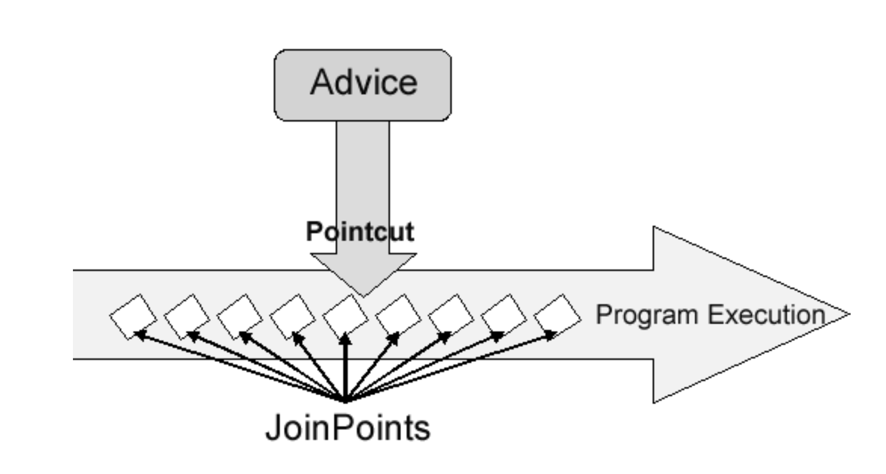

# HW14
1. List all the annotations you learned from class and homework to annotation.md  
   see annotation.md [here](annotation.md)
2. Briefly reading: https://www.techgeeknext.com/spring-boot/spring-aop-interview-questions
3. What is the Aspect Oriented Programming, explain it with detailed use cases?
   > Aspect-Oriented Programming (AOP) is a programming paradigm that aims to increase modularity by allowing the separation of cross-cutting concerns. It does so by adding additional behavior to existing code (an advice) without modifying the code itself, instead separately specifying which code is modified via a "pointcut" specification.
   
   `Run method to send user Alert after arriving a new place`
   * Aspect: (Class)A modular part of a program that encapsulates a cross-cutting concern. Aspects include advices and pointcuts.
   * Advice: (After)Code that an aspect executes at certain join points determined by a pointcut. There are different types of advice including "before", "after", and "around".
   * Pointcut: (Arriving)A predicate that matches join points. Pointcuts determine whether an advice executes at a particular join point in the program.
   * Join Point: (Method)A specific execution point in the application, such as method execution, exception handling, or field access.
   * Weaving: The process of applying aspects to a target object to create a new proxied object. Weaving can happen at compile time, load time, or runtime.
   
   **Usage:**
    
   | Usage                  | Problem                                                                                                                                                                                            | AOP Solution                                                                                                                                                                                                                                                                             |
   |------------------------|----------------------------------------------------------------------------------------------------------------------------------------------------------------------------------------------------|------------------------------------------------------------------------------------------------------------------------------------------------------------------------------------------------------------------------------------------------------------------------------------------|
   | Logging and Tracing    | Applications often require logging for diagnostics and tracing to understand the flow of execution. Implementing these directly in business logic can clutter the code and reduce maintainability. | Define an aspect that automatically logs entry and exit points of methods across the application without modifying the business logic. For example, using @Before and @After advices, you can log method names and parameters when methods are entered and exited.                       |
   | Transaction Management | Managing transactions typically involves repetitive boilerplate code across multiple methods that perform database operations.                                                                     | Create a transaction aspect that starts a transaction before the business method begins and commits or rolls back the transaction after the method executes. This can be implemented using @Around advice to handle the transaction management based on the method success or exception. |
   | Security               | Security, such as authentication and authorization, often needs to be enforced across various parts of an application.                                                                             | An aspect can intercept calls to sensitive methods and check whether the current user has the necessary rights to execute the action. If not, the aspect can throw a security exception or redirect the user to a login page.                                                            |
   | Error Handling         | Consistent error handling is crucial but can lead to redundant code scattered across multiple components.                                                                                          | Define a global exception handling aspect that intercepts exceptions and handles them according to the type of exception (e.g., logging, notifying support teams, or providing user feedback).                                                                                           |
   | Performance Monitoring | Monitoring the performance of certain operations within an application can involve intrusive modifications if done within the business logic.                                                      | Use an aspect to monitor the execution time of specific methods, logging or alerting if performance thresholds are exceeded. This is typically done with an @Around advice that measures the time before and after method execution.                                                     |
   | Resource Management    | Ensuring resources like database connections and files are properly closed after usage.                                                                                                            | An aspect can ensure that resources are closed properly by wrapping method executions in try-finally blocks using @Around advice.                                                                                                                                                        |
4. What are the advantages and disadvantages of Spring AOP?
   * Advantages:
     * Implemented in pure Java
     * No need for separate compilation process
     * Centralize or modularize the cross-cutting concerns
     * Easy to learn and apply
   * Disadvantages:
     * Only runtime weaving is available
     * Less Powerful – only supports method level weaving
     * Can only be implemented on beans managed by Spring container
5. Explaining the following concept in your own words, you may include code snippet as part of your answer.
    
   1. Aspect: 独立在外的container，里面的东西影响多个class，类似exception handler
      ```java
      @Aspect
      public class LoggingAspect {
          @Before("execution(* com.example.service.*.*(..))")
          public void logBeforeAllMethods() {
              System.out.println("A method is about to be called...");
          }
      }
      ```
   2. PointCut: 决定aspects触发的时间
      ```java
      @Pointcut("execution(* com.example.service.*.*(..))")
      public void allServiceMethods() {}
      ```
   3. JoinPoint: 被pointcut选择的 aspect can be plugged in的锚点(有很多) 
      ```java
      @Before("allServiceMethods()")
      public void logJoinPointDetails(JoinPoint joinPoint) {
          System.out.println("Method: " + joinPoint.getSignature().getName() + " is about to be executed.");
      }
      ```
   4. Advice: @Before那些。当有PointCut时，什么时候执行 aop methods
      ```java
      @Around("allServiceMethods()")
      public Object profileAllMethods(ProceedingJoinPoint proceedingJoinPoint) throws Throwable {
          long start = System.currentTimeMillis();
          Object returnValue = proceedingJoinPoint.proceed();
          long duration = System.currentTimeMillis() - start;
          System.out.println("Execution of " + proceedingJoinPoint.getSignature().getName() + " took " + duration + " milliseconds.");
          return returnValue;
      }
      ```
6. How do we declare a pointcut, can we declare it without annotating an empty method? Name some expressions to do it.
   ```java
   // pointcuts are declared using the @Pointcut annotation on an empty method.
   @Aspect
   @Component
   public class MyAspect {
       @Pointcut("execution(* com.example.service.*.*(..))")
       public void serviceMethods() {
           // This space intentionally left blank
       }
   
       @Before("serviceMethods()")
       public void beforeServiceMethod(JoinPoint joinPoint) {
           System.out.println("Before executing service method");
       }
   }
   
   // or without an empty method
   @Aspect
    @Component
    public class MyAspect {
    @Before("execution(* com.example.service.*.*(..))")
    public void beforeServiceMethod(JoinPoint joinPoint) {
    System.out.println("Before executing service method");
    }
    }
   ```
    **Expression**
    - Method execution: `execution(public * com.example.service.*.*(..))` – Matches all public methods in classes under `com.example.service` package.
    - Within: `within(com.example.service.*)` – Matches all join points within types in the `com.example.service` package. `within(com.example.service..*)` – Matches all join points within types in the `com.example.service` package and its sub-packages.
    - Bean: `bean(accountService)` – Matches all the methods in the bean named `accountService`.
    - Annotations: `@annotation(org.springframework.transaction.annotation.Transactional)` – Matches any method annotated with `@Transactional`.
    - Args: `args(java.io.Serializable)` – Matches any method that takes a single Serializable parameter.
    - You can create more complex expressions combining these, using &&, ||, and ! to combine expressions logically.
    
7. Compare different types of advice in Spring AOP.

   | Type                   | Trigger                                                                                                                  | Use Case                                                                                                                                                                                                                                          | Example                                               | Limitations                                                                                                                        |
   |------------------------|--------------------------------------------------------------------------------------------------------------------------|---------------------------------------------------------------------------------------------------------------------------------------------------------------------------------------------------------------------------------------------------|-------------------------------------------------------|------------------------------------------------------------------------------------------------------------------------------------|
   | Before Advice          | Runs before the join point’s method execution                                                                            | Commonly used for cross-cutting concerns like logging entry points or validating input arguments before method execution.                                                                                                                         | Logging method parameters before a method execution.  | It cannot prevent the execution from proceeding unless it throws an exception.                                                     |
   | After Returning Advice | Executes after a method returns normally (i.e., without throwing any exceptions).                                        | Useful for modifying or inspecting return values from methods, or performing actions based on the successful completion of operations.                                                                                                            | Post-processing data returned by a method.            | Does not execute if the method exits by throwing an exception.                                                                     |
   | After Throwing Advice  | Runs when a method exits by throwing an exception.                                                                       | Ideal for handling exceptions in a centralized manner rather than within business logic.                                                                                                                                                          | Logging exceptions or sending alert notifications.    | Only triggers on exceptions, not on normal method completions.                                                                     |
   | After (Finally) Advice | Executes after a method completes, regardless of the outcome (i.e., whether it returns normally or throws an exception). | Used for releasing resources (like file handles or database connections), which must happen regardless of method success or failure.                                                                                                              | Closing a database connection.                        | Does not have access to the method's return value and cannot determine if the method completed successfully or threw an exception. |
   | Around Advice          | Encapsulates a join point such as method invocation; can perform custom behavior before and after the method invocation. | Most powerful type of advice, allowing for complete control over method execution. Useful for performance monitoring, transaction management, or when needing to decide whether to proceed with the join point execution or modify its execution. | Measuring execution time or implementing retry logic. | More complex to implement; can potentially alter the normal flow of execution if not handled carefully.                            |

8. Reading: https://www.javainuse.com/spring/sprbatch_interview
9. Spring WebFlux vs Stream API+CompletableFuture, why use Spring WebFlux over the other?

    |            | WebFlux                                                                                                                                                         | Stream API + CompletableFuture                                                                                                                  |
    |------------|-----------------------------------------------------------------------------------------------------------------------------------------------------------------|-------------------------------------------------------------------------------------------------------------------------------------------------|
    | Purpose    | Designed for building reactive web applications that need to handle a large number of concurrent users or streams of data efficiently.                          | Enhances Java's concurrency framework, allowing for asynchronous programming within a mostly synchronous Spring MVC environment.                |
    | Technology | Uses the Reactive Streams API, enabling non-blocking I/O operations and supporting backpressure to manage data flow dynamically.                                | Utilizes Java's CompletableFuture for composing asynchronous logic and the Stream API for processing collections of data in a functional style. |
    | Use Case   | Ideal for applications where scalability and efficient resource utilization are critical, such as real-time data processing or highly interactive applications. | Suitable for applications that require some level of asynchronous processing but do not need a fully non-blocking model or reactive streams.    |

   * Why Choose Spring WebFlux Over Stream API + CompletableFuture?
     * Non-blocking Nature: WebFlux is fully non-blocking and more suitable for environments where threads may be blocked by I/O operations, leading to better performance under high load.
     * Reactive Programming Support: Offers built-in support for reactive programming, making it easier to develop robust, scalable applications that handle streams of data efficiently.
     * Backpressure Handling: Automatically manages backpressure, which is crucial for applications dealing with real-time streaming data.
10. When to use Spring Batch? please provide detailed examples of the business context.
    > Spring Batch is a powerful tool designed for the processing of large volumes of data and automating batch processes. It's well-suited for environments where data needs to be processed in large batches, not in real time but as part of a scheduled or triggered process.
    1. Financial Transactions
       * Scenario: A financial institution needs to process transactions daily, including transfers, payments, and adjustments. These transactions are collected throughout the day and processed in bulk during off-peak hours to ensure system performance during high-traffic periods.
       * Use Case: Spring Batch can automate the end-of-day batch processing of transactions. It ensures that all transactions are processed reliably and provides features like transaction management and error handling to deal with inconsistencies or failures.
    2. Data Migration
       * Scenario: A company is upgrading its database or switching to a different data storage solution. This requires migrating possibly millions of records from one system to another.
       * Use Case: Spring Batch provides a structured way to handle large-scale data migrations. It can read data from the source database, process it if necessary (for instance, transforming data formats or validating data), and write it to the new database, handling any errors or retries without manual intervention.
    3. Email Campaigns
       * Scenario: Marketing departments often send out email campaigns to thousands or millions of subscribers. These campaigns might be personalized and need to process user data to determine the content of the emails.
       * Use Case: Spring Batch can handle the extraction of user data, the decision logic for personalizing emails, and the preparation of email content. The batch job can segment users, personalize messages, and prepare batches of emails for delivery by an email delivery system.
11. How does Spring Batch work? you may include code snippet as part of your answer.
    * Job: A batch process that you define, which encapsulates an entire batch process.
    * Step: Each job is made up of one or more steps; a step is an independent part of a job and includes a single task like reading, processing, or writing data.
    * ItemReader: Component responsible for reading input data from a resource (like a database, XML file, CSV file, etc.).
    * ItemProcessor: An optional component where the business logic is applied to each input item.
    * ItemWriter: Component responsible for writing data to a destination (like a database, XML file, etc.).
    ```java
    // Reading from CSV, processing, and writing to a database
    // ItemReader: Reads data from people.csv and maps it to Person objects.
    // ItemProcessor: Converts names to uppercase.
    // ItemWriter: Writes the processed Person objects to an H2 database.
    // Job and Step Configuration: Defines a job named importUserJob with one step. The step processes data in chunks of 10.
    @Configuration
    @EnableBatchProcessing
    public class BatchConfig {
    
        @Bean
        public ItemReader<Person> reader() {
            FlatFileItemReader<Person> reader = new FlatFileItemReader<>();
            reader.setResource(new ClassPathResource("people.csv"));
            reader.setLineMapper(new DefaultLineMapper<Person>() {{
                setLineTokenizer(new DelimitedLineTokenizer() {{
                    setNames(new String[] { "firstName", "lastName" });
                }});
                setFieldSetMapper(new BeanWrapperFieldSetMapper<Person>() {{
                    setTargetType(Person.class);
                }});
            }});
            return reader;
        }
    
        @Bean
        public ItemProcessor<Person, Person> processor() {
            return person -> new Person(person.getFirstName().toUpperCase(), person.getLastName().toUpperCase());
        }
    
        @Bean
        public ItemWriter<Person> writer(DataSource dataSource) {
            JdbcBatchItemWriter<Person> writer = new JdbcBatchItemWriter<>();
            writer.setItemSqlParameterSourceProvider(new BeanPropertyItemSqlParameterSourceProvider<>());
            writer.setSql("INSERT INTO people (first_name, last_name) VALUES (:firstName, :lastName)");
            writer.setDataSource(dataSource);
            return writer;
        }
    
        @Bean
        public Job importUserJob(JobBuilderFactory jobs, Step step1) {
            return jobs.get("importUserJob")
                    .incrementer(new RunIdIncrementer())
                    .flow(step1)
                    .end()
                    .build();
        }
    
        @Bean
        public Step step1(StepBuilderFactory stepBuilderFactory, ItemReader<Person> reader,
                           ItemWriter<Person> writer, ItemProcessor<Person, Person> processor) {
            return stepBuilderFactory.get("step1")
                    .<Person, Person>chunk(10)
                    .reader(reader)
                    .processor(processor)
                    .writer(writer)
                    .build();
        }
    
        @Bean
        public DataSource dataSource() {
            DriverManagerDataSource dataSource = new DriverManagerDataSource();
            dataSource.setDriverClassName("org.h2.Driver");
            dataSource.setUrl("jdbc:h2:mem:test;DB_CLOSE_DELAY=-1");
            dataSource.setUsername("sa");
            dataSource.setPassword("");
            return dataSource;
        }
    }
    ```
12. How can we schedule a Spring Batch Job?  
    [example](https://blog.51cto.com/u_15499328/5278139)
    1. Add Dependencies
    2. Configure the Scheduler
13. What is the cron expression?
    > A cron expression is a string of text used to describe or define a schedule for some routine. It comprises six or seven fields that represent different components of the schedule, separated by spaces
    `Seconds Minutes Hours DayofMonth Month DayofWeek`
    
    Example: `0 15 10 ? * MON-FRI`: Executes at 10:15 AM every Monday to Friday.
14. Explain Spring task?
    > Spring Task generally refers to the capabilities provided by Spring for task scheduling and asynchronous execution. This functionality is crucial for applications that need to perform background tasks, schedule jobs to run at specific times, or execute tasks asynchronously to improve performance and responsiveness.
15. What is Filter and any filter example?
    >  Filter is a reusable code segment that can manipulate incoming requests to a server or outgoing responses from a server before they reach a servlet or after they leave the servlet.
    [more](https://segmentfault.com/a/1190000039996829)
    ```java
    @WebFilter("/exampleFilter/*")
    public class ExampleFilter implements Filter {
        
        public void init(FilterConfig filterConfig) throws ServletException {
            // Initialization code here
        }
    
        public void doFilter(ServletRequest request, ServletResponse response, FilterChain chain) 
                throws IOException, ServletException {
            // Log the request
            System.out.println("Request received at " + System.currentTimeMillis());
    
            // Pass the request along the filter chain
            chain.doFilter(request, response);
            
            // You can also manipulate the response here
            System.out.println("Response sent at " + System.currentTimeMillis());
        }
    
        public void destroy() {
            // Cleanup code here
        }
    }
    ```
16. What is the Interceptor? What we can do with interceptor?
    > An Interceptor is a concept used primarily in frameworks like Spring MVC or Hibernate that allows developers to intercept and manipulate the process of a method invocation, HTTP request handling, or database operations. Interceptors provide a powerful way to handle cross-cutting concerns (such as logging, authentication, auditing, and performance monitoring) separately from business logic.  

    **Spring MVC Interceptors**:
     * Modify request and response objects
     * Authentication and Authorization
     * Logging and Auditing
     * Exception Handling
     * Performance Monitoring

    **Hibernate Interceptors**:
     * Entity Auditing: Automatically set properties like lastModifiedTime, lastModifiedBy before an entity is saved or updated.
     * Validating Changes: Before updating or creating an entity, ensure that the entity's state complies with business rules.
     * Logging Access or Changes: Log any access to or changes in the entities.
     * Caching Logic: Implement custom caching strategies.
17. In Interceptor, What is preHandle? What is postHandle?  
    * preHandle(): 在handle执行之前，返回boolean值，true表示继续执行，false为停止执行并返回。
    * postHandle(): 在handle执行之后，可以在返回之前对返回的结果进行修改。
18. What is Swagger, why do we need it? What does it do except "documentation"?
    > Swagger (now known as the OpenAPI Specification) is an open-source framework designed to help developers design, build, document, and consume RESTful web services. It defines a standard, language-agnostic interface to REST APIs which allows both humans and computers to discover and understand the capabilities of the service without access to source code, documentation, or through network traffic inspection.
    
    * Why do we need swagger?
      * Documentation: Swagger automatically generates documentation for APIs, making it easier for developers to understand and use them. The documentation is interactive, allowing users to try out API calls directly from the browser.
      * Client SDK Generation: Swagger can generate client libraries (SDKs) for various programming languages and platforms, making it easier and faster to integrate with the API.
      * API Design and Testing: Developers can design their APIs with Swagger UI before writing any code and get feedback on API designs from stakeholders. Furthermore, Swagger provides tools like Swagger Inspector for testing APIs.
    
    * What does swagger do except "documentation"?
      Code Generation, Testing Support, API Gateway Integration
