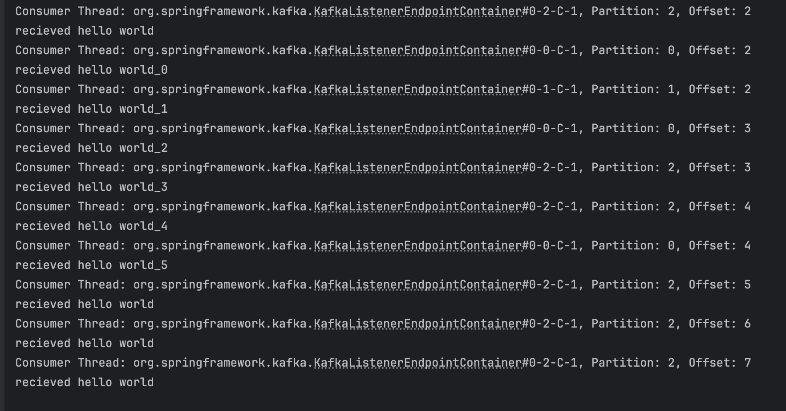
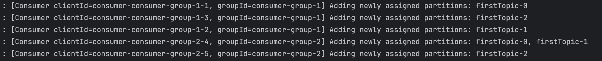
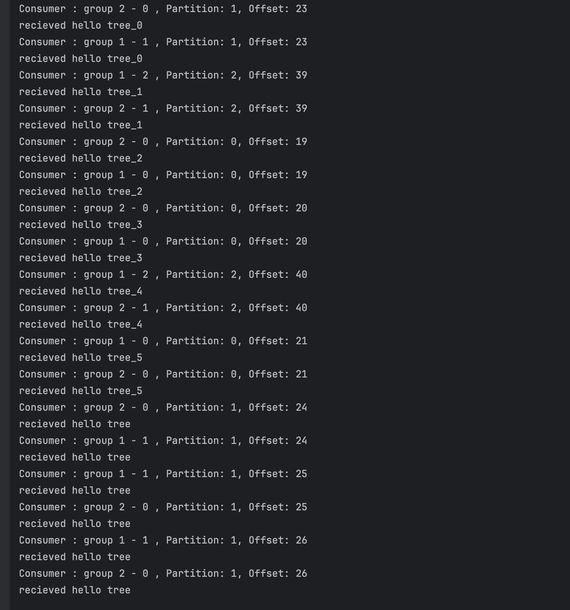
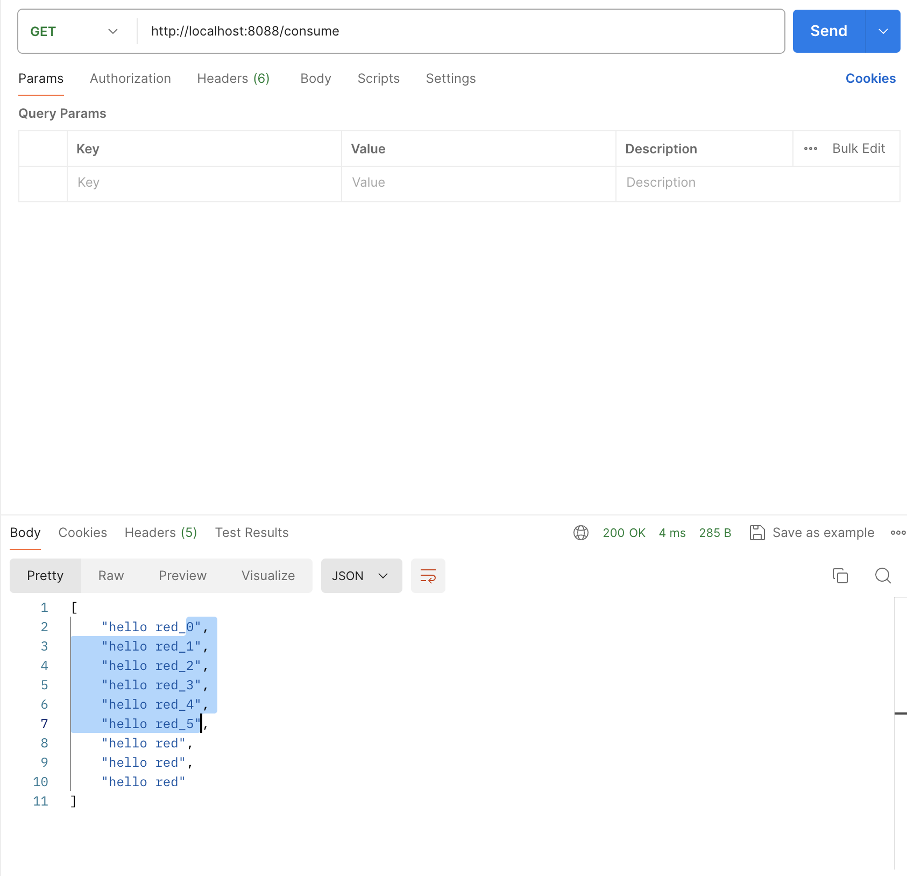
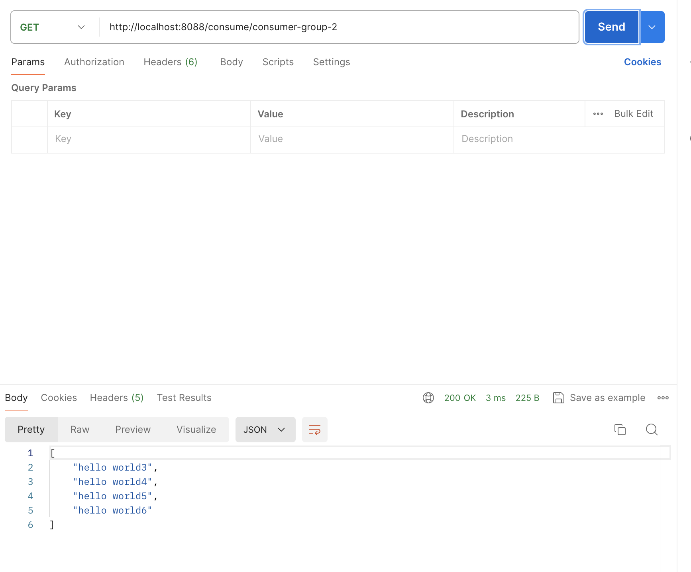

# Step 3: 1 consumer group
2. Running 3 Consumers in Group: consumer-group-1 with topic: firstTopic
   
2. In the program, the topic has 3 partitions, when I set the consumer size to 4, only 3 consumer works.
   to make sure about the order of the message, no two or more consumers in one groups listen to same topic partition.
# Step 4: 2 consumer groups
### Settings:
consumer group 1: 3 consumers
consumer group 2: 2 consumers

# Step 5: REST API
1. As a user, I am able to get messages consumed by the consumer application
   
2. As a  user, I am able to specify which consumer group and topic that I want to get messages from
   
3. The REST response should be optimized (e.g. paged)