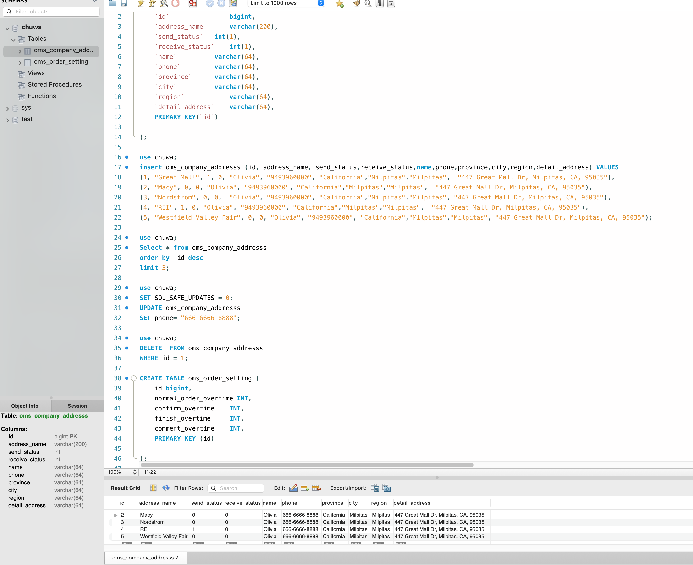
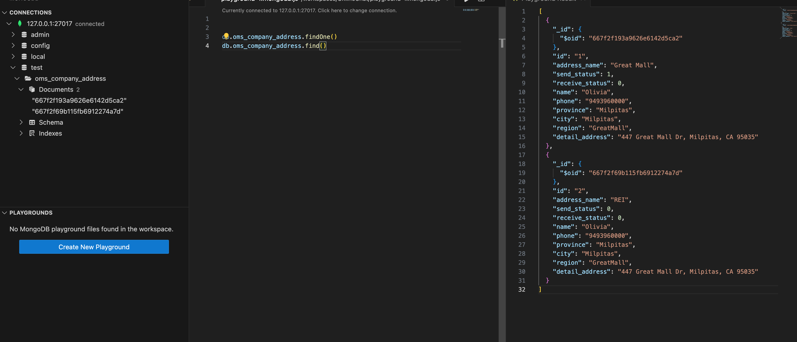
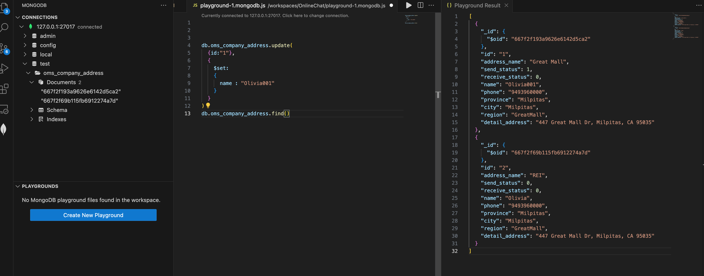
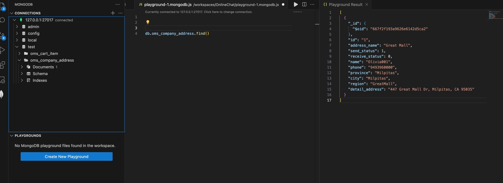

# SQL


1. Create oms_company_address table
    ```
    CREATE TABLE oms_company_addresss (
   
        `id`    bigint,
        `address_name`  varchar(200),
        `send_status`   int(1),
        `receive_status`    int(1),
        `name`  varchar(64),
        `phone`	    varchar(64),
        `province`   varchar(64),
        `city`  varchar(64),
        `region`    varchar(64),
        `detail_address`    varchar(64),
        PRIMARY KEY(`id`)

    );
    ```
2. Insert some random data to oms_company_address table
    ```
    insert oms_company_addresss (id, address_name, send_status,receive_status,name,phone,province,city,region,detail_address) VALUES
    (1, "Great Mall", 1, 0, "Olivia", "9493960000", "California","Milpitas","Milpitas",  "447 Great Mall Dr, Milpitas, CA, 95035"),
    (2, "Macy", 0, 0, "Olivia", "9493960000", "California","Milpitas","Milpitas",  "447 Great Mall Dr, Milpitas, CA, 95035"),
    (3, "Nordstrom", 0, 0,  "Olivia", "9493960000", "California","Milpitas","Milpitas", "447 Great Mall Dr, Milpitas, CA, 95035"),
    (4, "REI", 1, 0, "Olivia", "9493960000", "California","Milpitas","Milpitas",  "447 Great Mall Dr, Milpitas, CA, 95035"),
    (5, "Westfield Valley Fair", 0, 0, "Olivia", "9493960000", "California","Milpitas","Milpitas", "447 Great Mall Dr, Milpitas, CA, 95035")
    ```
3. Write a SQL query to fetch all data from oms_company_address `table
    ```
   Select * from oms_company_addresss;
   ```
4. Write a SQL query to fetch top 3 records from oms_company_address table
   not sure what does top 3 mean, so return the top 3 id
   ```
   Select * 
   from oms_company_addresss
   order by  id desc
   limit 3
   
   ```
5. Update oms_company_address table to set all phone to 666-6666-8888
   ```
    SET SQL_SAFE_UPDATES = 0;
    UPDATE oms_company_addresss
    SET phone= "666-6666-8888"
   ```
6. Delete one entry from oms_company_address table
   ```
   DELETE  FROM oms_company_addresss
   WHERE id = 1;
   ```
7. (Optional)You can also try to create other tables that listed above
    ```
    CREATE TABLE oms_order_setting (
	   id bigint,
       normal_order_overtime INT,
       confirm_overtime	INT,
       finish_overtime		INT,
       comment_overtime	INT,
       PRIMARY KEY (id)
    
    );
    ```

# NoSQL - MongoDB
- create db, create collection, create 2 documents and with findOne() find()
       
- update the document
       
- delete and create another collection
      
1. Create `test` DB   
    `use test`
2. Create oms_company_address collection (method: createCollection() )
    `db.createCollection("oms_company_address")`
3. Insert few random entries to oms_company_address collection (method: insert() )
    ```
    db.oms_company_address.insertOne({
        id: "1",
        address_name: "Great Mall",
        send_status: 1,
        receive_status: 0,
        name: "Olivia",
        phone : "9493960000",
        province: "Milpitas",
        city: "Milpitas",
        region: "GreatMall",
        detail_address: "447 Great Mall Dr, Milpitas, CA 95035"
    })
    ```
4. Read one entry from oms_company_address collection (method: find() )
    ```
    db.oms_company_address.findOne()
    db.oms_company_address.find({id:"2"})
    
    ```
5. Read all entries from oms_company_address collection (method: find() )
    `db.oms_company_address.find()`
6. Update one entry from oms_company_address collection (method:update() or save()) 
    ```
    db.posts.updateOne( 
        { id: "1 },
        {
           $set:
           {
            name: "Olivia001",
           }
        }
    )
    ```
7. Remove one entry from oms_company_address collection( method:remove())
    ```
    remove is deprecated
    db.oms_company_address.deleteOne({id:"2"})
    ```
8. (Optional) You can also try to create other tables that listed above
    ```
    db.createCollection("oms_cart_item")
    ```

# API Design
1. find the customer's payments, like credit card1,credit card2,paypal,ApplePay.
   `GET v1/customers/{customerId}/payments`
1. Find the customer's history orders from 10/10/2022 to 10/24/2022
   `GET v1/customers/{customerId}/orders?startDate=2022-10-10&endDate=2022-10-24`
2. find the customer's delievery addresses
   `GET v1/customers/{customerId}/delivery_addresses`
3. If I also want to get customer's default payment and default delievery address,what kind of the API (URL) should be ?       
   - `GET v1/customers/{customerId}/payments?type=default`
   - `GET v1/customers/{customerId}/delivery_address?type=default`
4. Find 2 collection of APIs example, ie. Twitter,paypal,youtube, etc
   - paypal
     - https://api-m.sandbox.paypal.com/v1/invoicing/invoices?page=3&page_size=4&total_count_required=true
     - https://api-m.sandbox.paypal.com/v2/checkout/orders/5O190127TN364715T
   - youtube
     - v1/operations/{operationsId}
     - v1/projects/{projectsId}:predict
     - v1/projects/{projectsId}/models
5. Design a collection of APIs for a BLOG Website, please specify GET POST PUT DELETE
    - get all posts
      - GET v1/blog/posts
    - get a single post
      - GET v1/blog/posts/{id}
    - create a post
      - POST v1/blog/posts
    - update a blog post
      - PUT v1/blog/posts/{id}
    - delete a blog
      - DELETE v1/blog/posts/{id}
    - get/create comments of a blog
      - GET v1/blog/comments/{id}
      - POST v1/blog/posts/{id}/comments
     