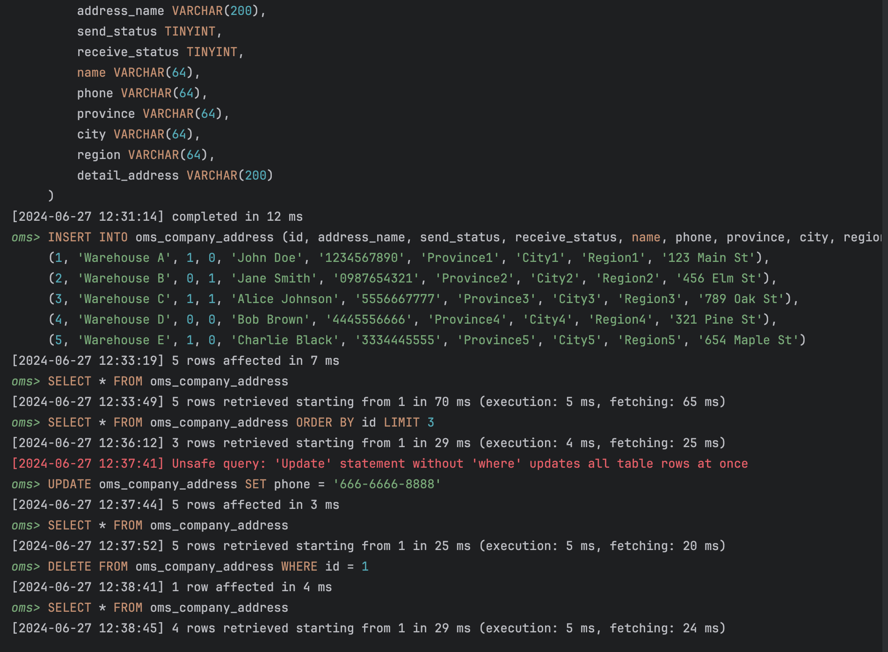
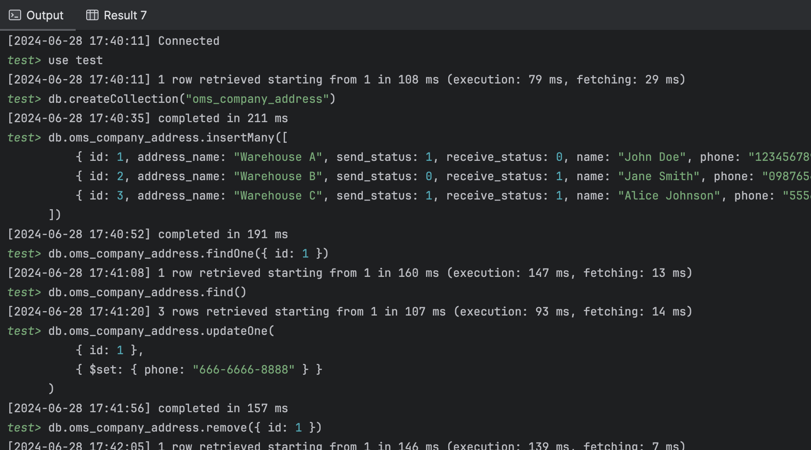

#### MYSQL Exercise

```mysql
# 1.Create  oms_company_address  table
CREATE DATABASE oms;
USE oms;
CREATE TABLE oms_company_address (
    id BIGINT PRIMARY KEY,
    address_name VARCHAR(200),
    send_status TINYINT,
    receive_status TINYINT,
    name VARCHAR(64),
    phone VARCHAR(64),
    province VARCHAR(64),
    city VARCHAR(64),
    region VARCHAR(64),
    detail_address VARCHAR(200)
);

# 2. Insert some random data to  oms_company_address  table
INSERT INTO oms_company_address (id, address_name, send_status, receive_status, name, phone, province, city, region, detail_address) VALUES
(1, 'Warehouse A', 1, 0, 'John Doe', '1234567890', 'Province1', 'City1', 'Region1', '123 Main St'),
(2, 'Warehouse B', 0, 1, 'Jane Smith', '0987654321', 'Province2', 'City2', 'Region2', '456 Elm St'),
(3, 'Warehouse C', 1, 1, 'Alice Johnson', '5556667777', 'Province3', 'City3', 'Region3', '789 Oak St'),
(4, 'Warehouse D', 0, 0, 'Bob Brown', '4445556666', 'Province4', 'City4', 'Region4', '321 Pine St'),
(5, 'Warehouse E', 1, 0, 'Charlie Black', '3334445555', 'Province5', 'City5', 'Region5', '654 Maple St');

# 3. Write a SQL query to fetch all data from  oms_company_address  `table
SELECT * FROM oms_company_address;

# 4. Write a SQL query to fetch top 3 records from  oms_company_address  table
SELECT * FROM oms_company_address ORDER BY id LIMIT 3;

# 5. Update  oms_company_address  table to set all  phone to 666-6666-8888
UPDATE oms_company_address SET phone = '666-6666-8888';

# 6. Delete one entry from  oms_company_address  table
DELETE FROM oms_company_address WHERE id = 1;

# 7. (Optional) You can also try to create other tables that listed above
# Created oms_order table here
CREATE TABLE oms_order (
    id BIGINT PRIMARY KEY,
    member_id BIGINT,
    order_sn VARCHAR(64),
    create_time DATETIME,
    member_username VARCHAR(64),
    total_amount DECIMAL(10,2),
    pay_amount DECIMAL(10,2),
    freight_amount DECIMAL(10,2),
    pay_type TINYINT,
    source_type TINYINT,
    status TINYINT,
    order_type TINYINT,
    delivery_company VARCHAR(64),
    delivery_sn VARCHAR(64),
    auto_confirm_day INT,
    bill_type TINYINT,
    receiver_name VARCHAR(100),
    receiver_phone VARCHAR(32),
    receiver_post_code VARCHAR(32),
    receiver_province VARCHAR(32),
    receiver_city VARCHAR(32),
    receiver_region VARCHAR(32),
    receiver_detail_address VARCHAR(200),
    note VARCHAR(500),
    confirm_status TINYINT,
    delete_status TINYINT,
    payment_time DATETIME,
    delivery_time DATETIME,
    receive_time DATETIME,
    comment_time DATETIME,
    modify_time DATETIME
);
```



### MongoDB Exercise

```mongodb
// 1. Create test db
use test

// 2. Create `oms_company_address` collection
db.createCollection("oms_company_address")

// 3. Insert a few random entries to oms_company_address collection
db.oms_company_address.insertMany([
    { id: 1, address_name: "Warehouse A", send_status: 1, receive_status: 0, name: "John Doe", phone: "1234567890", province: "Province1", city: "City1", region: "Region1", detail_address: "123 Main St" },
    { id: 2, address_name: "Warehouse B", send_status: 0, receive_status: 1, name: "Jane Smith", phone: "0987654321", province: "Province2", city: "City2", region: "Region2", detail_address: "456 Elm St" },
    { id: 3, address_name: "Warehouse C", send_status: 1, receive_status: 1, name: "Alice Johnson", phone: "5556667777", province: "Province3", city: "City3", region: "Region3", detail_address: "789 Oak St" }
])

// 4. Read one entry from oms_company_address collection
db.oms_company_address.findOne({ id: 1 })

// 5. Read all entries from oms_company_address collection
db.oms_company_address.find()

// 6. Update one entry from oms_company_address collection
db.oms_company_address.updateOne(
    { id: 1 },
    { $set: { phone: "666-6666-8888" } }
)

// 7. Remove one entry from oms_company_address collection:
db.oms_company_address.deleteOne({ id: 1 })

```

