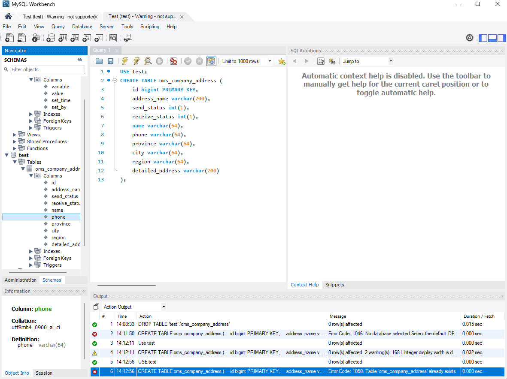

# HW6
## Exercise1
### 1. Create oms_company_address table
```
CREATE TABLE oms_company_address (
    id bigint PRIMARY KEY,
    address_name varchar(200),
    send_status int(1),
    receive_status int(1),
    name varchar(64),
    phone varchar(64),
    province varchar(64),
    city varchar(64),
    region varchar(64),
    detailed_address varchar(200)
);
```

### 2. Insert some random data to oms_company_address table
```
INSERT INTO oms_company_address (id, address_name, send_status, receive_status, name, phone, province, city, region, detailed_address)
VALUES 
(1, 'OfficeA', 1, 0, 'Alice', '123-456-7890', 'California', 'Los Angeles', 'Westside', '123 Main St, Suite 100'),
(2, 'OfficeB', 0, 1, 'Bob', '987-654-3210', 'Texas', 'Dallas', 'Northside', '456 Oak St, Suite 200'),
(3, 'OfficeC', 1, 1, 'Charlie', '555-123-4567', 'New York', 'New York City', 'Eastside', '789 Pine St, Warehouse 3'),
(4, 'OfficeD', 1, 0, 'David', '444-987-6543', 'Florida', 'Miami', 'Southside', '101 Maple St, Suite 300');
```

### 3. Write a SQL query to fetch all data from oms_company_address `table
```
SELECT * FROM oms_company_address;

```

### 4. Write a SQL query to fetch top 3 records from oms_company_address table
```
SELECT * FROM oms_company_address LIMIT 3;
```

### 5. Update oms_company_address table to set all phone to 666-6666-8888
```
UPDATE oms_company_address
SET phone = '666-6666-8888'
WHERE id IS NOT NULL;
```

### 6. Delete one entry from oms_company_address table
```
DELETE FROM oms_company_address 
WHERE id = 4;
```

## Exercise2
### 1. Create test DB
```
use test
```

### 2. Create oms_company_address collection (method: createCollection() )
```
db.createCollection("oms_company_address")
```

### 3. Insert few random entries to oms_company_address collection (method: insert() )
```
db.oms_company_address.insert([
{
id: 1,
address_name: "OfficeA",
send_status: 1,
receive_status: 1,
name: "Alice",
phone: "123-456-7890",
province: "California",
city: "Los Angeles",
region: "Westside",
detailed_address: "123 Main St, Suite 100"
},
{
id: 2,
address_name: "OfficeB",
send_status: 0,
receive_status: 1,
name: "Bob",
phone: "987-654-3210",
province: "Texas",
city: "Dallas",
region: "Northside",
detailed_address: "456 Oak St, Suite 200"
}
])
```

### 4. Read one entry from oms_company_address collection (method: find() )
```
db.oms_company_address.find({"id":1})
```

### 5. Read all entries from oms_company_address collection (method: find() )
```
db.oms_company_address.find()
```

### 6. Update one entry from oms_company_address collection (method: update() or save() )
```
db.oms_company_address.update(
    { id: 1 }, 
    {
        $set: { 
            phone: "666-6666-8888",
        }
    }
)

```

### 7. Remove one entry from oms_company_address collection (method: remove() )
```
db.oms_company_address.remove({"id":2})
```

## API Design
### 1. find the customer's payments, like credit card 1, credit card 2, paypal, Apple Pay.
```GET /api/v1/customer/{id}/payment```
### 2. Find the customer's history orders from 10/10/2022 to 10/24/2022
```GET /api/v1/customer/{id}/orders?start-date=10-10-2022&end-date=10-24-2022```
### 3. find the customer's delivery addresses
```GET /api/v1/customer/{id}/delivery-addresses```
### 4. If I also want to get customer's default payment and default delivery address, what kind of the API (URL) should be?
- We can have default types separately in payment and address:
```
GET /api/v1/customer/{id}/payment?type=default\
GET /api/v1/customer/{id}/delivery-addresses?type=default
```
- Or we can have a default info profile for the uer:
```  
GET /api/v1/customer/{id}/default-info
```
### 5. Find 2 collection of APIs example. ie. Twitter, Paypal, Youtube etc. --
- Twitter
```
Tweets

Bookmarks
DELETE /2/users/:id/bookmarks/:tweet_id
GET /2/users/:id/bookmarks
POST /2/users/:id/bookmarks

Filtered stream
GET /2/tweets/search/stream
GET /2/tweets/search/stream/rules
POST /2/tweets/search/stream/rules

Hide replies
PUT /2/tweets/:id/hidden

Likes
DELETE /2/users/:id/likes/:tweet_id
DELETE /2/users/:id/likes/:tweet_id
GET /2/tweets/:id/liking_users
GET /2/users/:id/liked_tweets
POST /2/users/:id/likes

Manage Tweets
DELETE /2/tweets/:id
POST /2/tweets

Quote Tweets
GET /2/tweets/:id/quote_tweets

Retweets
DELETE /2/users/:id/retweets/:source_tweet_id
GET /2/tweets/:id/retweeted_by
GET /2/tweets/:id/retweets
POST /2/users/:id/retweets

Search Tweets
GET /2/tweets/search/all
GET /2/tweets/search/recent

Timelines
GET /2/users/:id/mentions
GET /2/users/:id/timelines/reverse_chronological
GET /2/users/:id/tweets

Tweet counts
GET /2/tweets/counts/all
GET /2/tweets/counts/recent

Tweets lookup
GET /2/tweets
GET /2/tweets/:id

Volume streams
GET /2/tweets/sample/stream
GET /2/tweets/sample10/stream

```
- Youtube
```
Channels
GET https://www.googleapis.com/youtube/v3/channels

Comments
GET https://www.googleapis.com/youtube/v3/comments

Search
GET https://www.googleapis.com/youtube/v3/search

Playlists 
GET https://www.googleapis.com/youtube/v3/playlists

Video
GET https://www.googleapis.com/youtube/v3/videos
```

### 6. Design a collection of APIs for a Blog Website, please specify GET POST PUT DELETE
```
Get User's info
GET /api/v1/user/{user}/info

Modify user's info
PUT /api/v1/user/{user}/info

Get all Blog form the user
GET /api/v1/user/{user}/blogs

Get a Blog form the user
GET /api/v1/user/{user}/blogs?blog-id={bid}

Get a Blog form the user with date
GET /api/v1/user/{user}/blogs?start-date={start-date}&end-date={end-date}

Create new Blog for the user
POST /api/v1/user/{user}/blogs

Edit the user's Blog
PUT /api/v1/user/{user}/blogs?blog-id={bid}

Delete a user's Blog
DELETE /api/v1/user/{user}/blogs?blog-id={bid}

Get comments of a Blog
GET /api/v1/blog/{bid}/comments

Post a comments on Blog
POST /api/v1/user/{user}/comments?comment-id={cid}

Post a comments on Blog
DELETE /api/v1/user/{user}/comments?comment-id={cid}
```