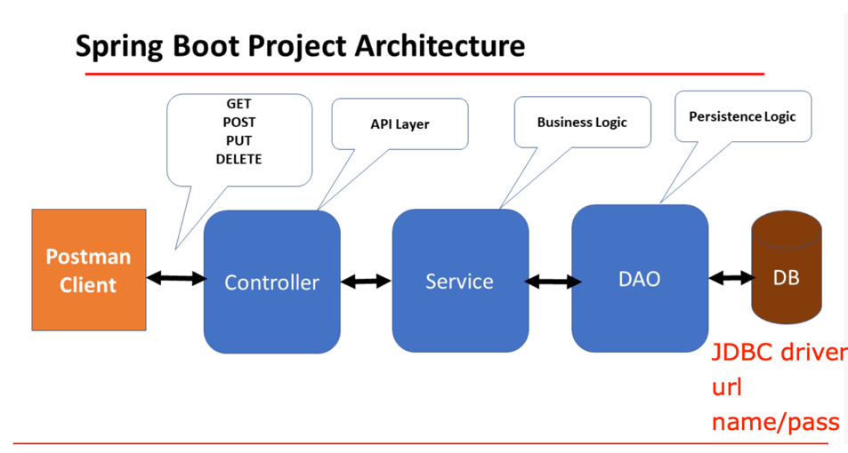

## 2. explain how the below annotaitons specify the table in database?

```java
@Column(columnDefinition = "varchar(255) default 'John Snow'")
private String name;
```

Defines the column type as varchar(255) and sets the default value to 'John Snow'.

```java
@Column(name="STUDENT_NAME", length=50, nullable=false, unique=false)
private String studentName;
```

Names the column STUDENT_NAME.
Sets the maximum length to 50 characters.
Marks the column as not nullable (nullable=false).
Allows duplicate values (unique=false).

## 3. What is the default column names of the table in database for @Column ?

```java
@Column
private String firstName;
@Column
private String operatingSystem;
```

Same as the field names in the Java class. 
firstName
operatingSystem

## 4. What are the layers in springboot application? what is the role of each layer?

Presentation Layer:
Role: Handles HTTP requests, performs authentication, and converts JSON fields to Java objects and vice versa.
Components: Controllers.

Business Layer:
Role: Contains business logic, performs validation and authorization.
Components: Services.

Persistence Layer:
Role: Manages storage logic.
Components: Repositories.

Database Layer:
Role: Actual database storage (e.g., MySQL, MongoDB).

## 5. Describe the flow in all of the layers if an API is called by Postman.



## 6. What is the application.properties? do you know application.yml?

application.properties:
Purpose: Used for configuration settings in a Spring Boot application.
Format: Key-value pairs.
Example:

```
server.port=8080
spring.datasource.url=jdbc:mysql://localhost:3306/mydb
spring.datasource.username=root
spring.datasource.password=password
```

application.yml:
Purpose: An alternative to application.properties for configuration settings in a Spring Boot application.
Format: YAML (YAML Ain't Markup Language), which is hierarchical and more human-readable.
Example:

```
server:
  port: 8080
spring:
  datasource:
    url: jdbc:mysql://localhost:3306/mydb
    username: root
    password: password
```

Both files serve the same purpose but offer different formats for specifying configuration properties.

## 7. Create a Project, name it with mongo-blog, write a POST API for mongo-blog, change database to MongoDB;

1. https://www.mongodb.com/compatibility/spring-boo
