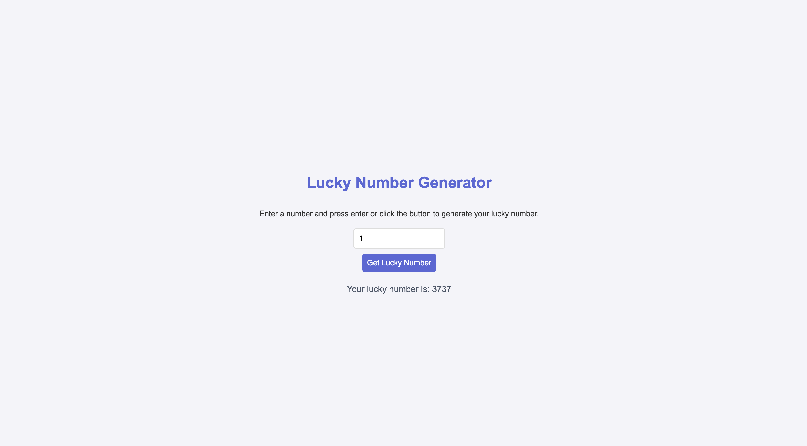
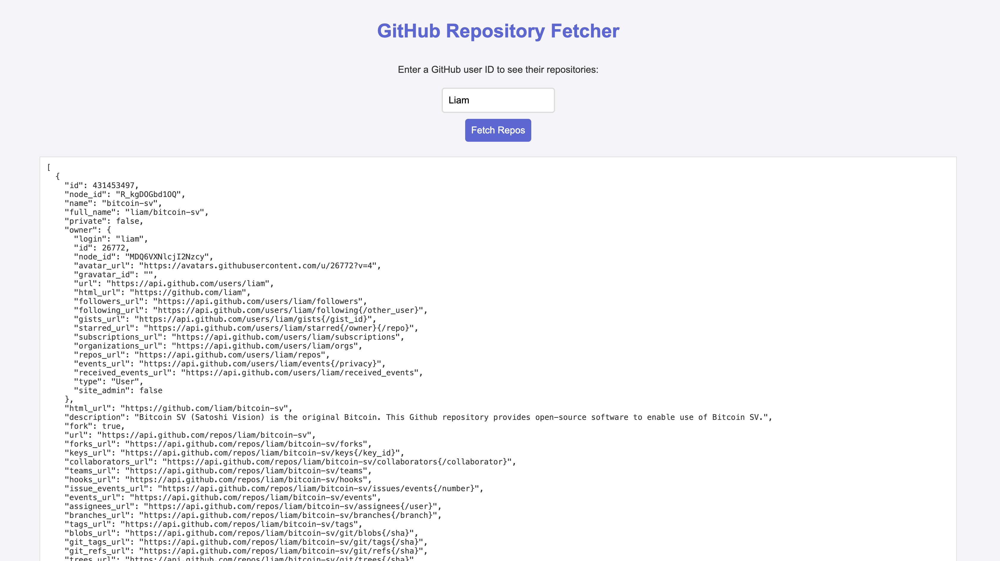

# HW20

1. Read and practice all sample codes from 71-Dom-Bom-JavaScript-Typescript-Node.md on your local browser or an online compiler.
2. Compare let vs var with your own code examples.
   - `var`: Declares a variable with function scope or global scope if declared outside of a function.
   - `let`: Declares a variable with block scope
   ```javascript
    function testVar() {
        if (true) {
            console.log(x); // Outputs: undefined, due to hoisting with 'var'
            var x = 2;
        }
        console.log(x); // Outputs: 2, because 'var' has function scope and is accessible throughout the function
    }
    
    function testLet() {
        if (true) {
            console.log(y); // ReferenceError: Cannot access 'y' before initialization
            let y = 3;
        }
        console.log(y); // Error: y is not defined, because 'let' has block scope and is only accessible within the if block
    }
    
    ```
3. Write an HTML page that generates a lucky number based on the date, time, and user inputs. Users should be able to get their random lucky numbers by clicking a button or using the enter key after typing the input.  
   see [Lucknumber.html](../Coding/JavaScript/Lucknumber.html)
   
4. Write an HTML page that returns a user's GitHub repos (https://api.github.com/users/{user_id}/repos) in JSON format. The web page should have a text box and a submit button where users can provide the GitHub user ID. The fetch call should be asynchronous. If the call to the above API fails for any reason, you should return a customized, user-friendly error message. If you know more than one approach to implement the asynchronous call, please do it using different approaches.  
   see [GithubFetch.html](../Coding/JavaScript/GithubFetch.html)
   
5. Explain Event Loop, Macrotask, and Microtask with code samples.
   - Event Loop: The event loop is a mechanism that executes program code, collects and processes events, and executes queued sub-tasks. It enables non-blocking I/O operations, despite JavaScript being single-threaded.
   - Macrotask: These tasks generally represent a sizable chunk of work that needs to be completed before moving on to the next task. A new macrotask will get started only once the current task is completed and the JavaScript stack is emptied.
     - `setTimeout`
     - `setInterval`
     - `setImmediate`
     - I/O
     - UI rendering
   - Microtask: Microtasks are smaller tasks that are processed at the end of the current task. They are used to make asynchronous operations predictable by guaranteeing their execution before the next macrotask starts.
     - `process.nextTick`
     - `Promise`
     - `MutationObserver`
```javascript
console.log('Start');

setTimeout(() => {
  console.log('Macrotask: setTimeout');
}, 0);

Promise.resolve()
  .then(() => {
    console.log('Microtask: Promise 1');
  })
  .then(() => {
    console.log('Microtask: Promise 2');
  });

console.log('End');
```   
Output: 
```javascript
Start
End
Microtask: Promise 1
Microtask: Promise 2
Macrotask: setTimeout
```

Another Example
```javascript
setTimeout(() => {
  console.log('Macrotask 1: setTimeout');
}, 0);

Promise.resolve().then(() => {
  console.log('Microtask 1: Promise');
});

setImmediate(() => {
  console.log('Macrotask 2: setImmediate');
});

console.log('Synchronous code');
```
Output
```javascript
Synchronous code
Microtask 1: Promise
Macrotask 1: setTimeout
Macrotask 2: setImmediate
```

   Please submit code, answers, and screenshots to your GitHub branch.