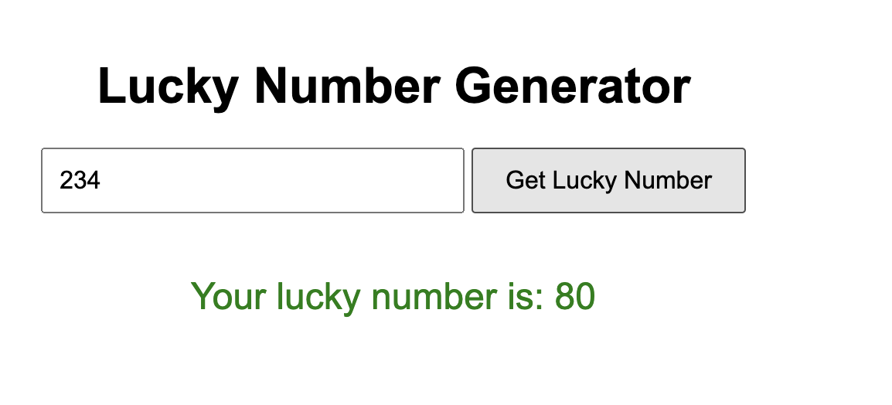
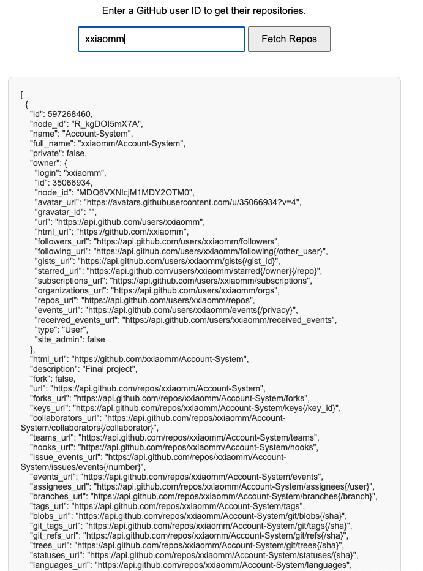

# HW 20 JavaScript

### 1. Read and practice all sample codes from 71-Dom-Bom-JavaScript-Typescript-Node.md on your local browser or an online compiler.  


### 2. Compare let vs var with your own code examples. 

#### Scope

- `var` is **function-scoped**. It can be accessed outside the block it was declared in, as long as it's within the same function.
- `let` is **block-scoped**. It can only be accessed within the block it was declared in.

```js
function scopeTest() {
    if (true) {
        var x = 10;  // Function-scoped
        let y = 20;  // Block-scoped
    }
    console.log(x); // 10 (accessible here)
    console.log(y); // ReferenceError (not accessible here)
}
```


#### Re-declaration

- `var` allows re-declaration within the same scope.
- `let` does **not** allow re-declaration within the same scope.

```js
function redeclareTest() {
    var a = 5;
    var a = 10;  // No error with var

    let b = 15;
    let b = 20;  // Error: Identifier 'b' has already been declared
}
```


#### Hoisting

- `var` is **hoisted** to the top of its scope and initialized with `undefined`.
- `let` is also **hoisted**, but it’s not initialized. Accessing it before declaration results in a `ReferenceError`.

```js
function hoistingTest() {
    console.log(c); // undefined (due to hoisting)
    var c = 30;

    console.log(d); // ReferenceError: Cannot access 'd' before initialization
    let d = 40;
}	
```


#### Global Object Property

- `var` declarations in the global scope become properties of the global object (`window` in browsers).
- `let` declarations do **not** create properties on the global object.

```js
var e = 50;
let f = 60;

console.log(window.e); // 50 (var becomes a global object property)
console.log(window.f); // undefined (let does not)
```


### 3. Write an HTML page that generates a lucky number based on the date, time, and user inputs. Users should be able to get their random lucky numbers by clicking a button or using the enter key after typing the input. 

see [code](../Coding/JavaScript/lucky.html)




### 4. Write an HTML page that returns a user's GitHub repos (https://api.github.com/users/{user_id}/repos) in JSON format. 

The web page should have a text box and a submit button where users can provide the GitHub user ID. The fetch call should be asynchronous. If the call to the above API fails for any reason, you should return a customized, user-friendly error message. If you know more than one approach to implement the asynchronous call, please do it using different approaches. 

see [code](../Coding/JavaScript/github.html)




### 5. Explain Event Loop, Macrotask, and Microtask with code samples.

### 1. **Event Loop**

The Event Loop is a mechanism in JavaScript that continually checks if the call stack is empty. If the call stack is empty, it looks for pending tasks in the macrotask queue and microtask queue to execute them. The main job of the event loop is to manage the execution of asynchronous operations, ensuring the non-blocking nature of JavaScript.

### 2. **Macrotask**

Macrotasks are the larger units of work that get processed by the event loop. Examples include:

- `setTimeout`
- `setInterval`
- `I/O operations`
- DOM events

These tasks are queued in the macrotask queue, and the event loop processes them one at a time, in the order they were added.

### 3. **Microtask**

Microtasks are smaller tasks that should be executed immediately after the currently executing script and before any macrotasks. Examples include:

- **Promises** (e.g., `.then` and `.catch` callbacks)
- `process.nextTick` (Node.js)
- `MutationObserver` (Browser API)

Microtasks have a higher priority than macrotasks and are processed before any macrotask can be executed.


```js
console.log("Script Start");

setTimeout(() => {
    console.log("setTimeout Macrotask");
}, 0);

Promise.resolve().then(() => {
    console.log("Promise Microtask 1");
}).then(() => {
    console.log("Promise Microtask 2");
});

console.log("Script End");


/** output:
Script Start
Script End
Promise Microtask 1
Promise Microtask 2
setTimeout Macrotask
*/
```

### Execution Flow:

1. **Synchronous Code**:
   - The synchronous code runs first.
   - "Script Start" is logged to the console.
   - The `setTimeout` callback is scheduled to run after 0 milliseconds, which places it in the macrotask queue.
   - A promise is resolved immediately, scheduling its `.then()` callback in the microtask queue.
   - "Script End" is logged to the console.
2. **Microtask Queue**:
   - After the synchronous code finishes, the event loop checks the microtask queue.
   - The first `.then()` callback logs "Promise Microtask 1".
   - The next `.then()` callback logs "Promise Microtask 2".
3. **Macrotask Queue**:
   - Finally, the event loop checks the macrotask queue and executes the `setTimeout` callback, logging "setTimeout Macrotask".

