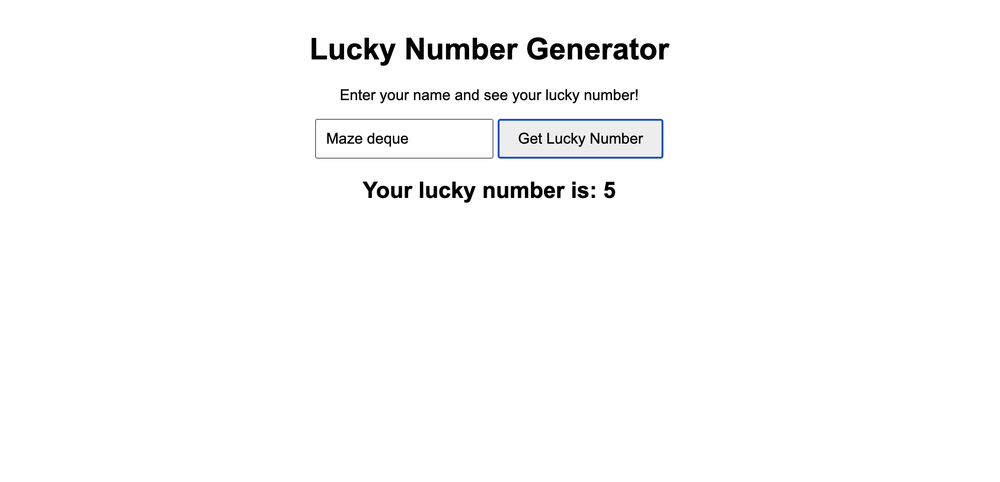
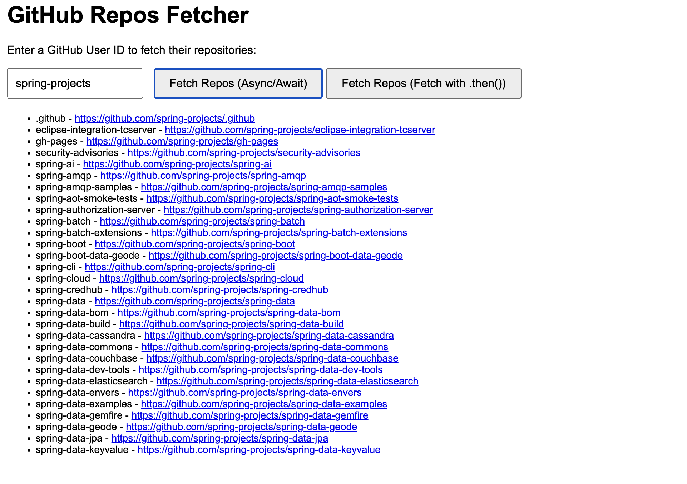

2. 
### Comparing `let` vs `var` in JavaScript

In JavaScript, both `let` and `var` are used to declare variables, but they have significant differences in terms of scope, hoisting, and re-declaration. This document compares these two keywords with illustrative code examples.

#### 1. Scope

- **`var`**: Function-scoped.
- **`let`**: Block-scoped.

##### Example 1: Scope

```javascript
function testVar() {
    if (true) {
        var x = 10;
    }
    console.log(x); // 10 (x is accessible outside the block)
}

function testLet() {
    if (true) {
        let y = 10;
    }
    console.log(y); // ReferenceError: y is not defined (y is block-scoped)
}

testVar();
testLet();
```

#### 2. Hoisting

- var: Variables declared with var are hoisted to the top of their scope and initialized with undefined.
- let: Variables declared with let are also hoisted but are not initialized. Accessing them before their declaration results in a ReferenceError.

##### Example 2: Hoisting

```javascript
function testVarHoisting() {
    console.log(a); // undefined (due to hoisting)
    var a = 5;
}

function testLetHoisting() {
    console.log(b); // ReferenceError: Cannot access 'b' before initialization
    let b = 5;
}

testVarHoisting();
testLetHoisting();
```

#### 3. Re-declaration

- var: Allows re-declaration of the same variable within the same scope.
- let: Does not allow re-declaration of the same variable within the same scope.

##### Example 3: Re-declaration

```javascript
function testVarRedeclaration() {
    var x = 10;
    var x = 20; // No error, x is re-declared
    console.log(x); // 20
}

function testLetRedeclaration() {
    let y = 10;
    let y = 20; // SyntaxError: Identifier 'y' has already been declared
    console.log(y);
}

testVarRedeclaration();
testLetRedeclaration();
```
3. 


4. 


5. 

### Understanding Event Loop, Macrotask, and Microtask in JavaScript

JavaScript is a single-threaded, non-blocking, asynchronous, concurrent language. To achieve asynchronous behavior, it uses an event loop mechanism that handles the execution of code, events, and tasks.

#### 1. Event Loop

The event loop is the core of JavaScript’s concurrency model. It is responsible for executing the code, collecting and processing events, and executing queued tasks.

##### How It Works:
- The call stack (where the code is executed) processes synchronous code first.
- If the code involves asynchronous operations (like `setTimeout` or promises), they are sent to the Web APIs to be handled.
- Once the asynchronous operation is complete, the callback is queued in either the **Macrotask Queue** or the **Microtask Queue**.
- The event loop checks if the call stack is empty. If it is, it first processes all microtasks in the Microtask Queue, and then processes one task from the Macrotask Queue.

#### 2. Macrotask (Task)

Macrotasks are tasks that include events like `setTimeout`, `setInterval`, `setImmediate` (in Node.js), and I/O operations. Each time a macrotask is executed, it runs to completion before the event loop checks the microtask queue.

##### Code Example:
```javascript
console.log('Start');

setTimeout(() => {
console.log('Timeout 1');
}, 0);

console.log('End');
```

##### Explanation:
- The synchronous code (\`console.log('Start')\` and \`console.log('End')\`) runs first.
- \`setTimeout\` schedules its callback as a macrotask in the macrotask queue.
- Once the synchronous code finishes executing, the event loop picks up the macrotask (\`setTimeout\` callback) and executes it.

#### 3. Microtask

Microtasks are tasks that need to be executed immediately after the currently executing script and before the event loop starts processing the macrotask queue. Promises (\`Promise.then\`), \`MutationObserver\`, and \`queueMicrotask\` are examples of microtasks.

##### Code Example:
```javascript
console.log('Start');

setTimeout(() => {
console.log('Timeout 1');
}, 0);

Promise.resolve().then(() => {
console.log('Promise 1');
});

console.log('End');
```

##### Explanation:
- The synchronous code (\`console.log('Start')\` and \`console.log('End')\`) runs first.
- The \`setTimeout\` callback is scheduled as a macrotask.
- The promise is resolved immediately and its callback is placed in the microtask queue.
- Before the event loop processes the macrotask, it first clears the microtask queue by executing the \`Promise.then\` callback.


##### Microtasks vs Macrotasks:

- Microtasks are processed after each synchronous operation and before the event loop processes the next macrotask.
- Even if there are multiple macrotasks waiting, all microtasks will be processed before moving on to the next macrotask.

#### 4. Combined Example

```javascript
console.log('Start');

setTimeout(() => {
console.log('Timeout 1');
}, 0);

setTimeout(() => {
console.log('Timeout 2');
}, 0);

Promise.resolve().then(() => {
console.log('Promise 1');
}).then(() => {
console.log('Promise 2');
});

console.log('End');
```

### Explanation:
- The synchronous code (\`console.log('Start')\` and \`console.log('End')\`) runs first.
- Two \`setTimeout\` callbacks are scheduled as macrotasks.
- The promise chain is scheduled as microtasks.
- The microtasks (\`Promise 1\` and \`Promise 2\`) are executed before the macrotasks (\`Timeout 1\` and \`Timeout 2\`).

## Summary

- **Event Loop**: Manages the execution of synchronous and asynchronous code.
- **Macrotask**: Larger asynchronous tasks like \`setTimeout\` and I/O operations that are processed one at a time in the macrotask queue.
- **Microtask**: Smaller asynchronous tasks like promises that are executed immediately after the current operation and before macrotasks.
