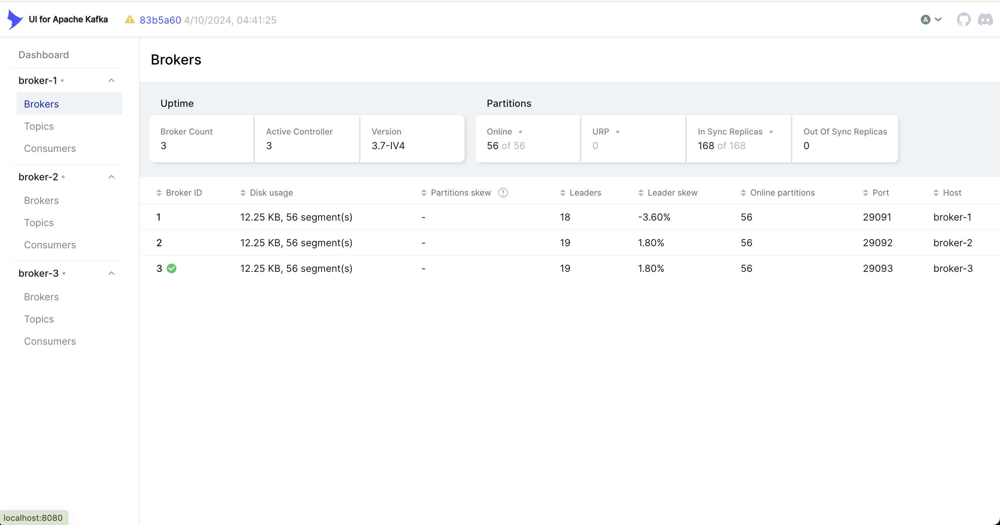
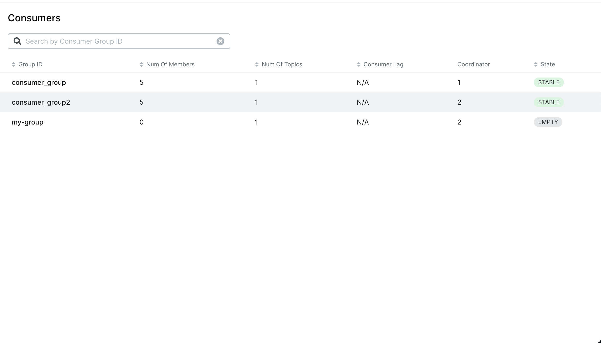
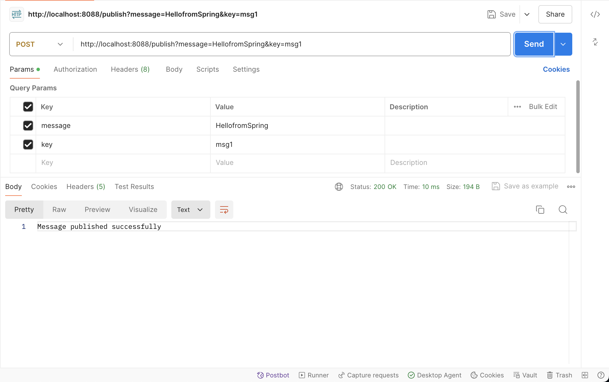

# HW-Kafka

## 1. Use following docker-compose file to start 3 brokers on your computer, this docker-compose also includes a kafka visualization tool, once your containers started, you may visit http://localhost:8080/ to get everything about your brokers and topic

## 2. Step 2: Run https://github.com/CTYue/Spring-Producer-Consumer/ on your local, only producer is included in this repo as of now. 

## 3. Write your consumer application with Spring Kafka dependency, set up 3 consumers in a single consumer group.

## 4.  Create multiple consumer groups using Spring Kafka, set up different numbers of consumers within each group, observe consumer offset,

## 5. Design backend REST APIs for your consumer application which satisfies following requirements:

