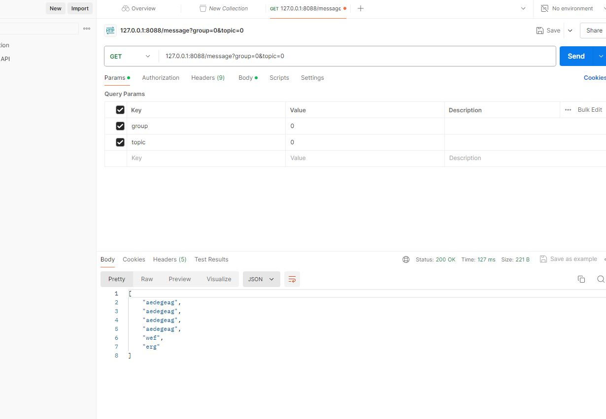

## Step 1: Use following docker-compose file to start 3 brokers on your computer, this docker-compose also includes a kafka visualization tool, once your containers started, you may visit http://localhost:8080/ to get everything about your brokers and topics.


## Step 3: Write your consumer application with Spring Kafka dependency, set up 3 consumers in a single consumer group.
```java
@Component
public class KafkaConsumer1 {
    @KafkaListener(topics = "${kafka.topic.name}", groupId = "group_topic_test0")
    public void topicListener1(ConsumerRecord<String, String> record) {
        String value = record.value();
        System.out.println("1:" + value + ", offset:" + record.offset() );
    }
}
```
### generate partition keys
``` java
@Component
public class CustomizePartitioner implements Partitioner {
    
    @Override
    public int partition(String topic, Object key, byte[] keyBytes, Object value, byte[] valueBytes, Cluster cluster) {

        List<PartitionInfo> partitionInfoList = cluster.availablePartitionsForTopic(topic);
        int partitionCount = partitionInfoList.size();
        int auditPartition = Math.abs(key.hashCode()) % partitionCount;

        return auditPartition;
    }
    
    @Override
    public void close() {
        System.out.println("colse ...");
    }
    
    @Override
    public void configure(Map<String, ?> configs) {
        System.out.println("init ...");
    }
}
```
### 1. Prove message consumption with screenshots.


### 2. Increase number of consumers in a single consumer group, observe what happens, explain your observation.
* There is an idle consumer

## Step 4: Create multiple consumer groups using Spring Kafka, set up different numbers of consumers within each group, observe consumer offset,
### Prove that each consumer group is consuming messages on topics as expected, take screenshots of offset records,


### Demo different message delivery guarantees in Kafka, with necessary code or configuration changes.
1. At least once: default
2. At most once: spring.kafka.producer.acks=0
3. Exactly once: configProps.put(ProducerConfig.ENABLE_IDEMPOTENCE_CONFIG, true);

### Step 5:
